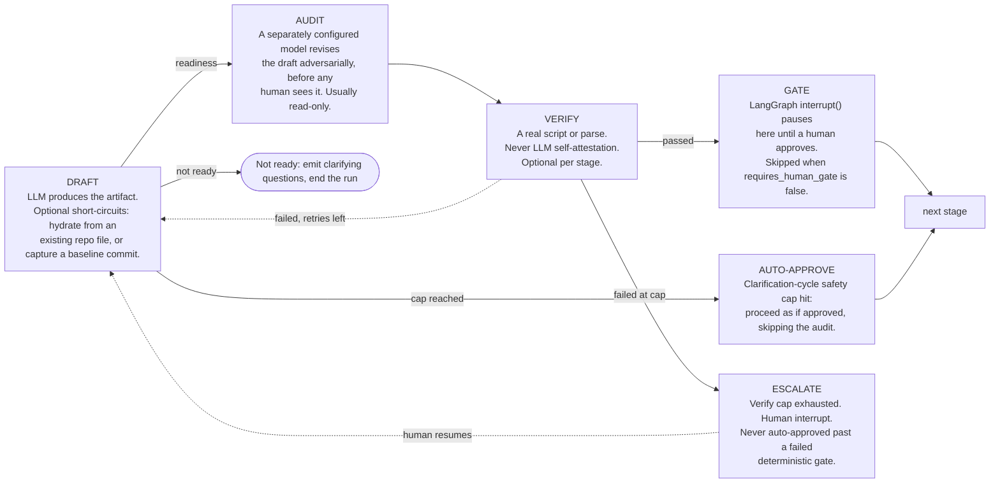

# ai-dev-workflow

A human-gated, LLM-driven software delivery pipeline built as a single [LangGraph](https://langchain-ai.github.io/langgraph/) state graph. Every stage drafts an artifact, has an adversarial second model audit it, runs a *deterministic* check (a real script or parse — never LLM self-attestation), and only then asks a human to approve. All work happens inside a per-session sandbox container holding a clone of the target repo/branch.

- Graph definition: [agent/src/graph.py](agent/src/graph.py)
- Frontend (AG-UI / CopilotKit): [src/](src/)
- Plan of record: [docs/PLAN.md](docs/PLAN.md)

---

## The whole graph, start to finish

Each box is one stage. The title says what the stage is for; the numbered lines are the operations it performs in order, including the skills and MCP servers it calls.

**Edge legend** — solid: normal flow · dotted: retry / loop-back · `human` label: the graph pauses on a LangGraph `interrupt()` until a person resolves it.

The pipeline opens with a suitability gate. `ai-dev-workflow` only applies to a repository containing a startable web app, API, or Azure Function; a library, a package, or a mobile-only repo is rejected with reasons, and the run ends there — the only hard stop in the graph. It runs before anything is written to the repository, so a rejected repo is left exactly as it arrived.

```mermaid
flowchart TD
    session["SESSION PROVISIONING &nbsp;·&nbsp; before the graph is ever invoked (agent/src/sessions_api.py)<br/>1. Next.js server route calls POST /sessions/provision with thread_id, owner, repo, branch<br/>2. sandbox factory picks a provider: local Docker or Azure ACI (agent/src/sandbox/)<br/>3. provider clones owner/repo at branch into /workspace/repo (a per-session named volume locally — the tree and any unpushed commits survive container removal; explicit session DELETE discards it), then checks out the tool-owned work branch ai-dev-workflow/&lt;branch&gt;-&lt;session prefix&gt; (session-suffixed so two users of the same repo+branch never share one force-pushed remote branch; reused from the volume when present, fetched from origin on brownfield re-entry, created fresh otherwise). The user's selected branch is never committed on. Copilot CLI token injected as env; the git clone token arrives as a one-shot pre-start file (never visible in docker inspect); per-owner package cache mounted at /opt/aidw/cache<br/>4. entrypoint runs bootstrap.sh: installs any toolchain the repo declares for itself (.tool-versions, mise.toml, .nvmrc, global.json) into /opt/aidw/tools — non-fatal, and never into the repo<br/>5. registry.set(thread_id, session); the GitHub token is retained agent-memory-only for stage-end pushes (git_ops.push_head) — every later node checks this registry before touching disk<br/>6. frontend does agent.addMessage(requirements) then runAgent() — this is what starts the graph"]

    intake["INTAKE &nbsp;·&nbsp; normalize the run and decide what carries over from previous runs<br/>1. mint a fresh run_id (used by the spec ledger, APPROVALS.md and metrics-report/exit snapshots)<br/>2. first invoke for this thread: hydrate every stage's state back out of the repo (workflow_persistence.py)<br/>3. seed default state for every StageSpec that has none yet<br/>4. reset specification onward to not_started — tech-stack and raw-requirements stay approved across runs<br/>5. split the newest HumanMessage into raw_requirements_text plus any image/document attachments"]

    scaffold["SCAFFOLD &nbsp;·&nbsp; read-mostly entry point (preflight_nodes.py)<br/>1. reset the workflow action ledger (fresh per session)<br/>2. capture git rev-parse HEAD as this run's baseline — the point the reject path resets back to<br/>3. read .ai-dev-workflow/manifest.json — its absence is the canonical never-onboarded-before signal<br/>Nothing is written to the repo here. The repo-visible writes wait until the suitability gate passes"]

    apre["APP DISCOVERY PRE &nbsp;·&nbsp; deterministic scan for startable applications (app_discovery.py)<br/>1. one bounded find for marker files: *.csproj, host.json, package.json, launchSettings.json, Program.cs, Dockerfile, manage.py, pyproject.toml, app.json, capacitor/ionic configs<br/>2. bounded reads: 60 files max, 4000 chars each, 24000-char evidence blob<br/>3. classify_candidates (pure): web SDK, Functions SDK, framework dependency, or negative evidence (library, no start script)<br/>4. fingerprint over path AND content hashes — the staleness signal for the next run's hydration"]

    app["APP DISCOVERY &nbsp;·&nbsp; does this repo contain an app this workflow can run?<br/>1. hydrate short-circuit: skip the LLM when the manifest already records an accepted result at this exact fingerprint<br/>2. draft: read-only tools, grounded in the scan but free to explore past it — the marker table has no Go/Rails/Spring/PHP rules and a false reject is unrecoverable<br/>3. audit: second model re-opens the cited files and drops anything it cannot substantiate<br/>4. no human gate — the deterministic decision below is the gate"]

    decide["APP DISCOVERY DECIDE &nbsp;·&nbsp; the verdict, deterministic and fail-closed<br/>1. drop any app whose cited path does not exist<br/>2. suitable = at least one web / api / azure_function app, on dotnet/node/python, with a real start command<br/>3. mobile is detected and rejected on purpose — the sandbox is a Linux container with no Android SDK, JDK/Gradle or Xcode<br/>4. no report at all is a rejection whose reason names that honestly, rather than blaming the repo<br/>5. reasons are composed from what was actually found, never from the model's own suitable flag"]

    reject["REJECT &nbsp;·&nbsp; the one hard stop in the graph<br/>1. post the reasons as a chat message and into shared state (the red banner in Requirements)<br/>2. verify every commit since the run baseline is the workflow's own; if not, skip the reset and say so<br/>3. git reset --hard to the baseline, git clean -fd .ai-dev-workflow<br/>4. END — the repo is left exactly as it arrived"]

    sfin["SCAFFOLD FINALIZE &nbsp;·&nbsp; the write half of scaffolding, deferred until the repo is accepted<br/>1. write AGENTS.md and a thin .github/copilot-instructions.md pointer if absent — never overwriting a human-authored one<br/>2. if AGENTS.md already exists, append only the pointer paragraph to .ai-dev-workflow/tech-stack.md, so a hand-written file still leads agents to the conventions<br/>3. fold agent-work/toolchain-bootstrap.json into .ai-dev-workflow/manifest.json, .ai-dev-workflow/ledger.jsonl and the host-side toolchain log<br/>4. commit them"]

    record["APP CHECK RECORD &nbsp;·&nbsp; persist the accepted apps<br/>1. read-modify-write app_check into .ai-dev-workflow/manifest.json: class, runtime, start command, port, evidence, fingerprint<br/>2. commit<br/>Placed after both branches converge on purpose: creating the manifest earlier would let a run abandoned mid-baseline skip brownfield ratification forever"]

    rscan["REPO SCAN BASELINE &nbsp;·&nbsp; measure the repository exactly as it arrived (repo_scan.py)<br/>1. run the full licence-vetted tool set offline: scc, lizard, jscpd, gitleaks, trivy, osv-scanner, semgrep, git churn — the summary streams into shared state (baseline_summary) to light the frontend metrics bar<br/>2. normalize every result into one Finding vocabulary and deduplicate across tools — trivy and osv-scanner name the same advisory differently, and OSV's alias lists are what reconcile them<br/>3. write .ai-dev-workflow/repo-scan-baseline.json and commit it<br/>4. idempotent on that file, and that is a correctness requirement: every node here is re-entered on every clarification round, and re-baselining would silently zero out the improvement the metrics-report delta exists to report<br/>Placed after both branches converge and before raw-requirements, so the clone exists and the stack is known but nothing has written application code yet"]

    p0pre["BROWNFIELD PRE &nbsp;·&nbsp; brownfield grounding (only when manifest.json is missing)<br/>1. deterministic grep of the repo for schemas, migrations and route definitions<br/>2. store the result as brownfield_context, so the baseline draft is grounded in facts rather than guesses"]

    p0["BROWNFIELD BASELINE &nbsp;·&nbsp; describe the existing system before changing it<br/>1. draft: read-only tool allowlist — skills: preflight-baseline, tech-stack-conventions, caveman<br/>2. audit: second model revises the baseline against the same grounding context<br/>3. gate: human ratifies the baseline<br/>4. brownfield_write_manifest: ratification is what actually creates .ai-dev-workflow/manifest.json"]

    ts["TECH STACK &nbsp;·&nbsp; detect languages, frameworks and build/test commands once per repo<br/>1. hydrate short-circuit: if .ai-dev-workflow/tech-stack.approved.json already exists, mark approved and skip the LLM entirely<br/>2. draft: read-only tool allowlist — skill: tech-stack-conventions<br/>3. audit: second model revises the detected stack<br/>4. no human gate — supporting infrastructure, it has no review tab<br/>5. post-approve hook: write each detected ecosystem's build-blocking config and append one paragraph per ecosystem to AGENTS.md — .NET gets &lt;solution-root&gt;/Directory.Build.props, Node/TS gets &lt;root&gt;/eslint.config.mjs plus its dev-dependencies, Python gets &lt;root&gt;/ruff.toml and &lt;root&gt;/mypy.ini<br/>Runs on the approved path, not post-audit, so it still fires on the hydrate short-circuit — otherwise a repo onboarded once would never receive a new or updated convention<br/>Everything downstream reads this: build commands, test commands, and whether Playwright/Excalidraw MCP get attached"]

    rr["RAW REQUIREMENTS &nbsp;·&nbsp; turn a human's rough ask into a structured requirements document<br/>1. hydrate short-circuit: an existing requirements file with no fresh human input skips the LLM<br/>2. draft: read-only tool allowlist — skill: brainstorming<br/>3. audit: second model revises the document<br/>4. gate: human approval<br/>5. post-audit hook: persist the seed text that produced this draft, so future runs can detect a change"]

    spec["SPECIFICATION &nbsp;·&nbsp; user stories and acceptance criteria with permanently stable ids<br/>1. draft: requirements text plus any attachments (screenshots/documents) — skill: spec-sync<br/>2. audit: adversarial revision — skills: ponytail (prose), spec-sync<br/>3. verify (deterministic): sync every US/AC id against spec/ledger.json, then commit the ledger<br/>4. gate: human approval<br/>5. sign: append a content-hash-signed row to APPROVALS.md so later tampering is detectable"]

    plan["IMPLEMENTATION PLAN &nbsp;·&nbsp; ordered steps plus diagrams, derived only from the approved spec<br/>1. draft: input is the approved Specification, never the raw requirements — UI-framework repos must also emit one self-contained HTML wireframe per new/changed screen (max 6, 30 KB each; inline CSS only, no scripts, no external URLs) and get impeccable `shape` methodology (read-only, no scripts)<br/>2. audit: adversarial revision — skill: ponytail (prose); also reviews and FIXES the wireframes against the spec (the auditor revises artifacts directly, there is no separate editor)<br/>3. verify (deterministic): validate every wireframe (name, size, self-containment — pure checks, no Chromium) and render every Mermaid diagram with mmdc inside the sandbox; a render failure is a syntax failure. Both are committed to .ai-dev-workflow/plan/ on pass<br/>4. gate: human approval<br/>5. sign: content-hash-signed row in APPROVALS.md"]

    p4["AC TO TESTS &nbsp;·&nbsp; write the failing tests first (TDD red), touching test files only<br/>1. capture baseline commit (git rev-parse HEAD) — the reference point for the write-scope check<br/>2. draft: autopilot write access, bash excluded, PreToolUse write-scope hook armed, Playwright MCP for UI repos — skills: ac-to-tests, test-driven-development<br/>3. audit: read-only allowlist — an adversarial pass never gets more trust than it needs<br/>4. verify (deterministic), both halves must pass:<br/>&nbsp;&nbsp;&nbsp;&nbsp;a. write-scope gate — git diff against the baseline commit, every changed path must be a test path<br/>&nbsp;&nbsp;&nbsp;&nbsp;b. AC-coverage gate — every active AC has a test whose name embeds its id, and that test is currently FAILING<br/>5. no human gate — the deterministic gate is the gate"]

    r4["R · REBUILD (scaffold-only fix) &nbsp;·&nbsp; the tree must still compile after new tests land<br/>1. run the stack's clean+build command; exit code is the whole gate — no LLM in the happy path<br/>&nbsp;&nbsp;&nbsp;.NET: dotnet build -warnaserror · Node/TS: build or tsc, then tsc --noEmit --strict and eslint --max-warnings=0 · Python: py_compile, then ruff check and mypy<br/>2. on failure, fix node may add compile-enabling stubs only, never real behavior — skill: systematic-debugging<br/>3. up to 3 fix cycles, then a human interrupt"]

    p6["MINIMAL CODE TO GREEN &nbsp;·&nbsp; write the least code that turns the ac-to-tests tests green<br/>1. draft: autopilot, full unscoped write access — skills: executing-plans, subagent-driven-development, ponytail (ultra, ADVISORY: Copilot arbitrates each suggestion, implements only what it agrees with, records rejections in ponytail_rejected); UI-framework repos also get impeccable design rules plus a one-time PRODUCT.md/DESIGN.md bootstrap from the approved spec<br/>2. audit: read-only allowlist — also reviews the ponytail arbitration itself<br/>3. verify (deterministic): 95% line+branch coverage, plus an anti-gaming check that coverage-exclusion config was not broadened<br/>4. gate: human approval"]

    r6["R · REBUILD (full fix) &nbsp;·&nbsp; clean build after real implementation work<br/>1. clean+build, gate on exit code<br/>2. on failure, full-scope fix — skill: systematic-debugging (4-phase root-cause analysis)<br/>3. up to 3 fix cycles, then a human interrupt"]

    p8["QUALITY REMEDIATION &nbsp;·&nbsp; analyzer findings triaged, fixed or explicitly suppressed<br/>1. quality_scan: dotnet build with SARIF ErrorLog and dotnet format --verify-no-changes, plus repo_scan's quality profile (jscpd duplication, lizard per-function complexity) — also refreshes repo-scan-latest.json and streams the summary to the metrics bar<br/>2. quality_triage: LLM decides fix-or-suppress per finding — skill: quality-triage<br/>3. quality_ledger_write: every suppression gets a written justification — no silent suppression<br/>4. quality_fix: dotnet format plus LLM fixes for what triage marked fixable — then git add -A commit + push (commit_all)<br/>5. R(quality): clean rebuild after the fixes<br/>6. quality_gate_check: analyzer errors and the duplication threshold gate absolutely; complexity findings gate only if they are NEW against the baseline scan, so a brownfield repo's inherited debt is reported and burned down rather than deadlocking its first gate<br/>7. pass, or loop back to scan (max 3 cycles), or escalate to a human gate"]

    p10["SECURITY REMEDIATION &nbsp;·&nbsp; same shape as P8, tuned for vulnerabilities and secrets<br/>1. security_scan: repo_scan's security profile — semgrep against vendored rules, trivy for vuln/misconfig/license/secret, gitleaks, osv-scanner — all fully offline against databases baked into the image, deduplicated across tools, plus a CycloneDX SBOM; refreshes repo-scan-latest.json and streams the summary to the metrics bar<br/>2. security_triage: fix-or-suppress per finding — skills: security-triage, security-review — a secret can NEVER be suppressed, enforced on the finding's category rather than on which tool reported it<br/>3. security_ledger_write: justification recorded for every suppression<br/>4. security_fix: LLM fixes the findings triage marked fixable — then git add -A commit + push (commit_all)<br/>5. R(security): clean rebuild<br/>6. security_gate_check: absolute, not delta-scoped — an inherited CVE is still exploitable. Zero unsuppressed findings at or above the severity floor (default: medium), else loop or escalate"]

    p11a["ADVERSARIAL AUDIT &nbsp;·&nbsp; does the code that now exists actually match the spec and plan?<br/>1. draft: compare approved Specification and Plan against the real repo, report divergences — skills: caveman, verification-before-completion; UI-framework repos also get an impeccable `critique`-style design review (read-only, no scripts), findings folded into the report<br/>2. audit: second model revises the divergence report<br/>3. gate: human review — the one interactive checkpoint inside the audit cluster"]

    p11b["DE-DUP / SIMPLIFY &nbsp;·&nbsp; collapse the duplication the pipeline just introduced<br/>1. dedup_simplify_pre: run jscpd through repo_scan, feed the parsed clone pairs into the draft prompt<br/>2. draft: autopilot write access, refactor the clusters — jscpd findings are authoritative; ponytail ultra + ponytail-audit run as ADVISORY proposals Copilot arbitrates (rejections recorded in ponytail_rejected); UI-framework repos also run impeccable's deterministic design detector and an impeccable `polish` pass over adversarial-audit's design findings<br/>3. audit: read-only review of the refactor, including the arbitration itself<br/>4. no human gate — jscpd's objective re-check at the audit exit gate is the real bound<br/>5. post-audit hook: re-run jscpd and record the new duplication percentage"]

    p11c["FINDING CLUSTER (DEPENDENCY UPGRADES) &nbsp;·&nbsp; verify-before-audit, because a bad upgrade is objectively detectable<br/>1. finding_cluster_pre: list outdated dependencies with the stack's own command<br/>2. finding_cluster_draft: write access — perform upgrades and regenerate lockfiles<br/>3. finding_cluster_verify: clean rebuild plus full test run<br/>4. pass, then finding_cluster_audit — read-only risk review of the upgrade<br/>5. fail with cycles left, then loop back to draft carrying the failure evidence<br/>6. fail at the cap, then finding_cluster_revert (git revert) and an informational human notice that never blocks the audit cluster"]

    p11d["LICENSE AUDIT &nbsp;·&nbsp; classify every dependency license against policy<br/>1. license_audit_pre: deterministic license scan, declared and detected licenses per package<br/>2. draft: classify each package against license-policy.json — skill: license-audit<br/>3. audit: second model revises the classification<br/>4. verify (deterministic): any flagged package escalates to a human immediately — max_verify_cycles is 0, since redrafting cannot change a license"]

    p11exit["AUDIT EXIT GATE &nbsp;·&nbsp; re-prove the objective properties instead of trusting earlier stages<br/>1. re-verify test coverage against the threshold<br/>2. re-verify duplication below the max percentage (default 3%)<br/>3. re-verify license policy and write THIRD-PARTY-NOTICES.md<br/>4. pass, or retry once, or escalate to a human gate that loops back into this same check"]

    r11["R · REBUILD (full fix) &nbsp;·&nbsp; clean build after all of the audit cluster's refactoring and upgrades"]

    p13["TEST HARDENING · FULL TEST SUITE + FLAKE QUARANTINE<br/>1. test_hardening_run_tests: run the whole suite with retries; parse trx (.NET) or vitest JSON (JS/TS)<br/>2. any stable failure, then test_hardening_regression_gate — a hard human interrupt, out of test-hardening's scope to fix<br/>3. test_hardening_flake_triage: narrow read-only LLM judgment over the intermittent failures<br/>4. test_hardening_mint_tickets: allocate real US-#### ids through spec_ledger.py — deterministic, never the LLM<br/>5. test_hardening_exit_check: every quarantined test is linked to a ticket, else escalate back into triage"]

    p14["METRICS REPORT + TRACEABILITY &nbsp;·&nbsp; deterministic, with exactly one named LLM exception<br/>1. run repo_scan's full profile: size and language mix, per-function complexity, duplication, churn/hotspots/ownership, and every deduplicated security finding with its CVE and fix version<br/>2. diff it against the baseline taken at the top of the graph — what was fixed, what was introduced, what got worse, and each metric's direction declared rather than inferred (more code is neutral, more duplication is a regression)<br/>3. read the coverage summary<br/>4. build traceability-matrix.md by matching AC ids embedded in test names back to the ledger<br/>5. sum token consumption from every stage's ledger entries<br/>6. write repo-scan-latest.json, repo-scan-delta.json and metrics-latest.json<br/>7. metrics_ponytail_gain: the one LLM call — run /ponytail-gain for the code/cost/speed scorecard<br/>No baseline recorded means the delta is omitted with a reason, never fabricated as a zero"]

    p15["EXIT &nbsp;·&nbsp; is this actually merge-ready?<br/>1. draft: merge-readiness report and PR description from the spec, plan and metrics-report metrics — skills: caveman, finishing-a-development-branch<br/>2. audit: adversarial second opinion on the readiness call<br/>3. gate: human approval — the final checkpoint of the entire pipeline<br/>4. sign: content-hash-signed row in APPROVALS.md<br/>5. exit_finalize (deterministic): update manifest.json, write the CHANGELOG entry from the ledger diff, commit"]

    pause(["PAUSE FOR HUMAN INPUT<br/>Any draft that comes back not-ready emits clarifying questions and ends the run.<br/>The human answers in chat, and the next run re-enters at INTAKE from the top."])

    done(["END"])

    session --> intake --> scaffold --> apre --> app --> decide
    decide -->|unsuitable| reject --> done
    decide -->|suitable| sfin --> ts
    ts -->|manifest.json exists| record
    ts -->|no manifest.json| p0pre
    p0pre --> p0
    p0 -->|human| record
    record --> rscan --> rr
    rr -->|human| spec
    spec -->|human| plan
    plan -->|human| p4
    p4 --> r4 --> p6
    p6 -->|human| r6 --> p8
    p8 --> p10 --> p11a
    p11a -->|human| p11b --> p11c --> p11d --> p11exit --> r11 --> p13
    p13 --> p14 --> p15
    p15 -->|human| done

    p4 -.->|write-scope or AC-coverage failure, 3 tries then human escalation| p4
    p6 -.->|coverage below threshold, 3 tries then human escalation| p6
    spec -.->|ledger sync failure| spec
    plan -.->|diagram render failure| plan
    p8 -.->|gate not met, max 3 cycles| p8
    p10 -.->|gate not met, max 3 cycles| p10
    p11exit -.->|retry once, then human| p11exit
    p13 -.->|unlinked quarantine| p13
    ts -.-> pause
    rr -.-> pause
    spec -.-> pause
    plan -.-> pause
    p6 -.-> pause
```

## Every file this pipeline writes into a target repo

| Path | Written by | Purpose |
|---|---|---|
| `AGENTS.md` | scaffold finalize, tech-stack | Cross-tool agent guidance. Created only if absent; an existing one is never overwritten, only appended to (one sentinel-guarded paragraph pointing at `.ai-dev-workflow/tech-stack.md`, plus one per detected ecosystem). |
| `.github/copilot-instructions.md` | scaffold finalize | Thin pointer to `AGENTS.md`. Created only if absent. |
| `.ai-dev-workflow/manifest.json` | brownfield-baseline, app discovery, exit, scaffold finalize | Onboarding state, accepted app record, run summary, and the `toolchain` record. Co-owned — every writer goes through one read-modify-write helper. |
| `.ai-dev-workflow/tech-stack.md` | tech-stack | The detected stack, rendered. **This is the file `AGENTS.md` tells every agent to read first.** |
| `.ai-dev-workflow/tech-stack.approved.json` | tech-stack | Typed sidecar. Its presence is what makes a later run skip detection entirely. |
| `.ai-dev-workflow/raw-requirements.md`, `specification.md`, `plan.md` | raw-requirements, specification, plan | The reviewed artifacts. |
| `.ai-dev-workflow/plan/diagrams/*.{mmd,svg}` | plan verify | Rendered Mermaid diagrams. |
| `.ai-dev-workflow/plan/wireframes/*.html` | plan verify | Self-contained HTML wireframes (UI plans only) — open directly in a browser. |
| `.ai-dev-workflow/ledger.jsonl` | every node | Per-session action log, including token usage and toolchain installs. Reset each session. |
| `.ai-dev-workflow/repo-scan-baseline.json` | repo scan baseline | The repository as it arrived, measured once and never re-measured. Delete it to force a re-baseline. |
| `.ai-dev-workflow/repo-scan-latest.json` | metrics-report | The same shape at the end of the run: deduplicated findings with severity, location, CVE and fix version, plus size/complexity/duplication/churn metrics and a health score. Findings carry no tool attribution — which tool found what lives in the report's `tools[]` run-health block. |
| `.ai-dev-workflow/repo-scan-delta.json` | metrics-report | Baseline versus latest: fixed, introduced, persisted, severity changes, and per-metric direction. Omitted, not faked, when no baseline exists. |
| `.ai-dev-workflow/metrics-latest.json` | metrics-report | The scan and its delta, plus coverage, traceability and token totals. |
| `<solution-root>/Directory.Build.props` | tech-stack | .NET analyzers + `TreatWarningsAsErrors`. |
| `<node-root>/eslint.config.mjs` | tech-stack | Shared ESLint baseline, plus the dev-dependencies it needs (`package.json` and the lockfile are committed with it). |
| `<python-root>/ruff.toml`, `<python-root>/mypy.ini` | tech-stack | Shared ruff + mypy baseline. |

The last three rows exist for one reason: an LLM reliably fixes what a deterministic tool *refuses to accept*, and treats everything else as advice. Each config is paired with a build command that fails on violation (see the R · REBUILD boxes above), which is what turns a lint finding into work the agent must complete.

Two caveats worth stating rather than burying:

- **Severity is not uniform across ecosystems.** .NET stays at `AnalysisLevel=latest-recommended`, the setting already in production use. Node/TS (`typescript-eslint` strict) and Python (`mypy --strict`) start stricter. Onboarding a legacy repo therefore often begins with a human escalation via quality-remediation's "build didn't succeed" short-circuit — that is the intended failure mode, not a bug.
- **The Node dev-dependency install is not human-gated**, because tech-stack detection is supporting infrastructure with no review tab. It lands as a single commit; `git revert` on that commit removes the config and the dependencies together.

A file already present and not written by this pipeline is left alone — a repo with its own `.eslintrc` or `eslint.config.js` keeps it, and no ESLint config is written at all. Our own files carry a version stamp in their header and are replaced when the bundled template moves forward; a file without that header is treated as human-authored.

## The sandbox filesystem

The image is immutable and deliberately small, so a repo needing a toolchain it doesn't ship installs one at runtime — never into the source tree.

| Path | Contents | Lifetime |
|---|---|---|
| `/workspace/repo` | the clone | the session. Never a mount target. |
| `/opt/aidw/tools` | mise-installed SDKs and anything else on `PATH` | the session — an executable on `PATH` is what would carry an attack between two sessions, so it is never shared |
| `/opt/aidw/cache` | npm / NuGet / pip / uv / mise download caches | a named Docker volume per repo **owner** (`aidw-cache-<owner>`) |

Both `/opt/aidw` paths are created and declared in the image itself, so a container behaves identically with or without the volume attached — the mount is an accelerator, never a correctness dependency. On Azure ACI the cache is an Azure Files share and is **off unless `AIDW_CACHE_SHARE` is set**: SMB's many-small-file throughput is poor enough that the cache can be slower than re-downloading, so it gets enabled after measurement.

[agent/sandbox-image/bootstrap.sh](agent/sandbox-image/bootstrap.sh) runs after the clone and after the git credentials are destroyed. It installs only what the repo declares for itself (`.tool-versions`, `mise.toml`, `.nvmrc`, `.node-version`, `global.json`), only from mise's own registry — a config naming an arbitrary plugin git URL is refused, since that is third-party shell that would otherwise run automatically before anything else in the container. Failure is never fatal: a missing toolchain surfaces later as a real build error, which beats a container that refuses to start. `apt-get` at runtime is impossible by construction (the container runs as non-root `vscode`); a genuine OS-package need is a `BASE_IMAGE` change.

What it found is recorded three ways: `.ai-dev-workflow/manifest.json`'s `toolchain` key (durable per repo, rewritten only when the tool set actually changes, and used for a warm start next run), `.ai-dev-workflow/ledger.jsonl` (this run's install metrics), and a host-side `agent/agent-work/toolchain.jsonl` (`$AIDW_TOOLCHAIN_LOG`). The host-side log is the one that answers "what should the next image ship" — commits are pushed to the ai-dev-workflow/<branch>-<session prefix> work branch at every stage end, so the in-repo copy survives the container.

## The stage template every box shares

Most of the boxes above are the same generated subgraph, built from one `StageSpec` entry in [agent/src/graph.py](agent/src/graph.py). Adding a stage means adding a spec, not rewiring the graph.

Every LLM prompt in the pipeline is an editable markdown file under [agent/src/prompts/](agent/src/prompts/) — see its README for the file-to-stage index. Edit a prompt, restart the agent, done (prompts are cached at first load).



Cross-cutting behavior that is not drawn above, because it happens in nearly every node: state is persisted to the sandbox repo and committed after each audit, verify and gate — and every successful commit is pushed to the `ai-dev-workflow/<branch>-<session prefix>` work branch on origin (`--force` — the branch is tool-owned and session-scoped, one writer by construction; a failed push is logged, surfaced in the UI via streamed `last_push` state, and never blocks the run). Generated source code is committed separately (`git add -A`) at every green rebuild and after each quality/security/dependency fix round, so the pushed branch always carries the code, not just the artifacts. Every LLM node appends a ledger entry with its token usage; a fresh run always re-enters at `intake`, abandoning any interrupt a previous run left open.

---

## E2E test mode (bypassing GitHub OAuth + MFA)

Automated browser tests cannot complete the real GitHub sign-in (OAuth + MFA). For local end-to-end testing only, set both:

```bash
AIDW_E2E_MODE=1            # activates the bypass; hard-refused when NODE_ENV=production
E2E_GITHUB_TOKEN=<PAT>     # classic PAT with `repo` read on the target repos
```

With E2E mode active: the middleware ([src/proxy.ts](src/proxy.ts)) stops enforcing sign-in, GitHub API routes fall back to the PAT ([src/lib/e2e.ts](src/lib/e2e.ts)), session provisioning forwards the PAT as the sandbox clone credential under the synthetic identity `e2e-user`, and a warning is logged at startup. Playwright can then drive `/select` → `/workflow/...` directly. Both variables default to off; the guard is conjunctive with the production check in every consumer.

---

## Keeping this diagram current

The diagram is generated by hand but guarded automatically. [.claude/hooks/graph-diagram-check.mjs](.claude/hooks/graph-diagram-check.mjs) hashes every file that defines the graph — `graph.py`, the node-cluster modules, `agent/src/gates/`, and `agent/src/prompts/` — and stamps that hash into this README. Two hooks in [.claude/settings.json](.claude/settings.json) run it:

- **PostToolUse** (after any edit) — injects a note telling Claude the diagram is stale.
- **Stop** (before the turn ends) — blocks the turn while the diagram is still stale, so it does not get forgotten.

After updating the diagram, re-stamp it:

```bash
node .claude/hooks/graph-diagram-check.mjs --stamp
```

<!-- graph-source-sha256: 839693dbbb084326c6ee7a77c67119de315e255ea17f3749454240a823e3c3e7 -->
