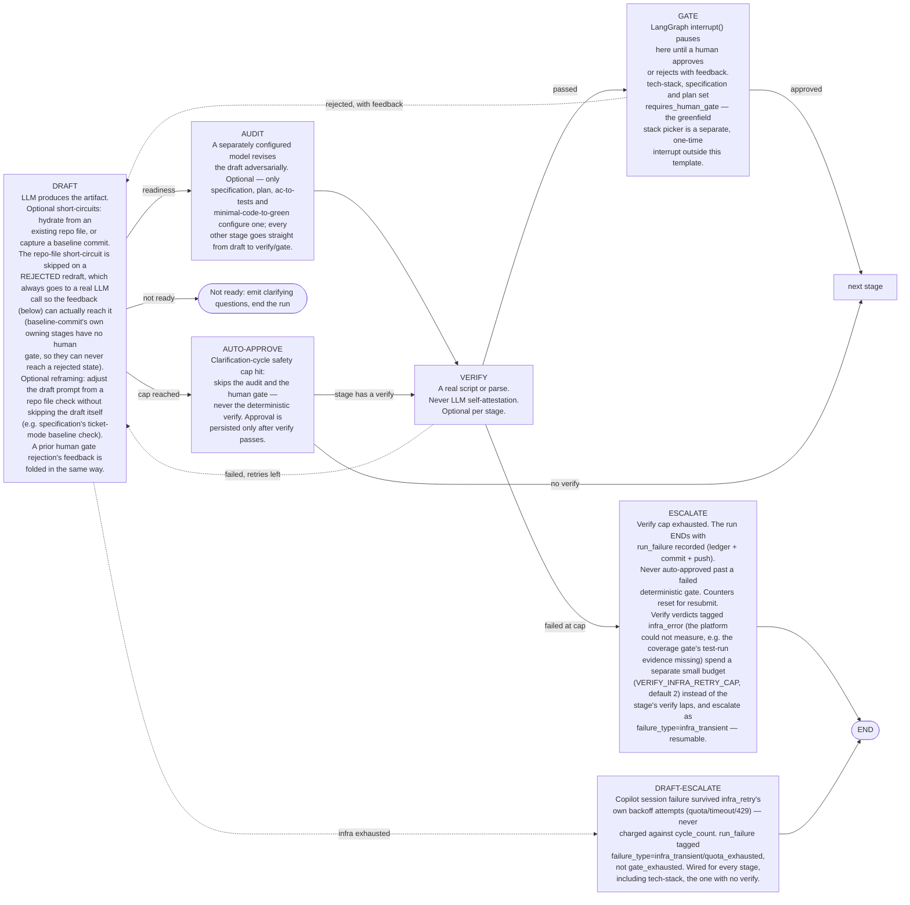
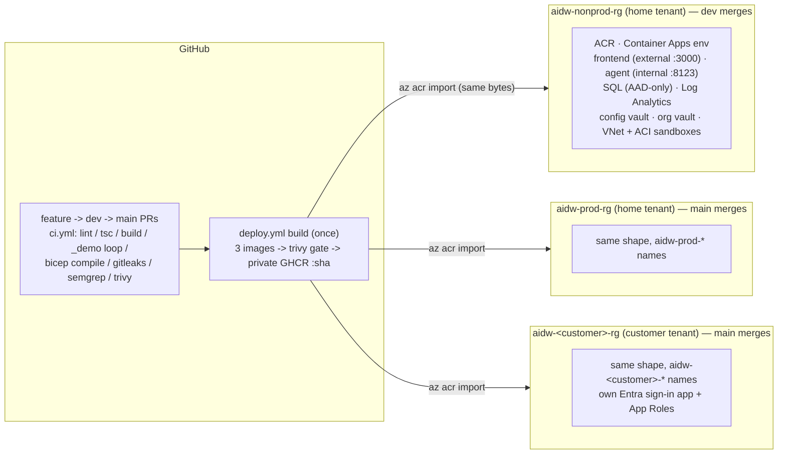

# ai-dev-workflow

A human-gated, LLM-driven software delivery pipeline built as a single [LangGraph](https://langchain-ai.github.io/langgraph/) state graph. Every stage drafts an artifact and runs a *deterministic* check (a real script or parse — never LLM self-attestation). Exactly four stages get an adversarial second-model audit (specification, plan, ac-to-tests, minimal-code-to-green); exactly three pause for a human by default (tech-stack, specification, plan) — the tech-stack pause is skipped once a repo carries an approved sidecar, and a greenfield (no existing app) repository gets a stack picker at that same pause. A human may approve or reject at any of those three gates; a rejection loops back to that stage's own draft with the reviewer's feedback folded into the next attempt, rather than ending the run. Every other failure ENDs the run with a `run_failure` record instead of waiting on a person. All work happens inside a per-session sandbox container holding a clone of the target repo/branch.

- Graph definition: [agent/src/graph.py](agent/src/graph.py)
- Frontend (AG-UI / CopilotKit): [src/](src/)
- Plan of record: [docs/PLAN.md](docs/PLAN.md)

---

## The whole graph: 8-stage pipeline

Clean sequential flow from intake through 8 stages, each integrating custom agents from agent files. Human pauses at tech-stack, specification and plan. Every stage from specification onward carries a deterministic verify (spec ledger, plan diagrams, AC coverage, coverage-contract replay, remediation re-scan, adversarial claim-check, exit readiness) — never LLM self-attestation.

```mermaid
flowchart TD
    session["SESSION PROVISIONING<br/>Sandbox + repo clone + toolchain bootstrap"]
    intake["INTAKE<br/>Normalize run; hydrate prior stage state"]
    scaffold["SCAFFOLD & APP DISCOVERY<br/>Baseline capture + app suitability check + greenfield stack picker"]
    scaffold_fin["SCAFFOLD FINALIZE<br/>Write AGENTS.md, tech-stack conventions"]
    
    stage1["STAGE 1: TECH STACK<br/>Detect languages, frameworks, build/test commands<br/>Agent: tech-stack-draft (read-only discovery)"]
    
    stage2["STAGE 2: SPECIFICATION<br/>Draft user stories + acceptance criteria (delta ticket: cite existing_us_id/existing_ac_id, retire removed features)<br/>Agents: specification-draft → specification-audit<br/>Verify: spec ledger id sync — stable US-####.# ids, fail-closed citations<br/>Gate: human approval + sign to APPROVALS.md; approval applies tracking resets for genuinely reworded ACs"]
    
    stage3["STAGE 3: PLAN<br/>Ordered implementation steps + diagrams + wireframes<br/>Agents: plan-draft → plan-audit<br/>Verify: step↔AC linkage BOTH directions (every step cites live ac_ids or kind=infrastructure;<br/>every undelivered AC cited; retired-only steps dropped) + Mermaid/wireframe validation<br/>Gate: human approval + sign to APPROVALS.md; approval records plan_step_ids on the ledger"]
    
    stage4["STAGE 4: AC-TO-TESTS<br/>Write failing tests (TDD red) for ELIGIBLE (undelivered) ACs only; delete tests naming retired ACs<br/>Agents: ac-to-tests-draft → ac-to-tests-audit (scaffold-only rebuild)<br/>Gate: write-scope + ledger-integrity + retired-residue + completed-AC protection + AC-coverage checks<br/>Post-scaffold TDD-red gate: zero passing tests (first ticket) / eligible-AC tests red (later tickets)"]
    
    stage5["STAGE 5: MINIMAL CODE TO GREEN<br/>Implement least code to pass tests; delete code serving only retired ACs<br/>Agents: minimal-code-to-green-draft → minimal-code-to-green-audit<br/>Gate: 95% line+branch coverage CONTRACT REPLAY (full rebuild)"]
    
    stage6["STAGE 6: REMEDIATION<br/>Pre-draft deterministic scan publishes fresh findings<br/>Draft fixes EVERY actionable finding, any severity (autopilot, write+bash);<br/>unfixable ones need a per-id reason in known_gaps<br/>Gate: deterministic re-scan blocks any unexplained actionable finding;<br/>baseline diff catches scanner-silencing. Rebuild gate after."]
    
    harden["TEST HARDENING + E2E<br/>Run suite Nx, triage flakes, regression gate<br/>Stable-regression fix loop (4 laps) before the gate ends the run<br/>Boot the app, run playwright, harvest screenshots<br/>Lighthouse perf + a11y scored against the live app (UI repos);<br/>scores below the configured floors join the fix loop<br/>Auth-enforcement gate (repo setting + Key Vault secrets present):<br/>probes every route + API unauthenticated; a 2xx on a protected route joins the fix loop<br/>E2E fix loop (8 laps); a failure records run_failure and routes INTO stage 8"]
    
    stage7["STAGE 7: ADVERSARIAL COMPLIANCE<br/>Closes the back half: audits finished repo vs approved Plan + wireframes<br/>Agent: adversarial-compliance-draft (read-only, full-repo review)<br/>Gate: deterministic claim-verification + fix prompt. Rebuild gate after<br/>(scan-delta placement re-runs ledger-integrity + retired-residue + completed-AC protection)."]
    
    readme["README LEG (metrics-exit)<br/>Writes/updates README.md per standard-readme, grounded in the code<br/>Deterministic structure check between laps (3); human-authored README left untouched<br/>Committed BEFORE the final scan so metrics cover it"]
    
    stage8["STAGE 8: METRICS + EXIT<br/>Measure delta vs baseline + merge-readiness decision<br/>Metrics: repo-scan (health score v3: 9 weighted subscores, density-aware security, × security-tool-coverage multiplier) + coverage + traceability + outdated-packages probe<br/>Regression-clean runs stamp per-AC delivery provenance on the ledger (coded/tested run ids + measured test names)<br/>Exit: deterministic merge-ready verdict + APPROVALS.md sign<br/>Exit report (09-metrics-exit.md + EXIT-REPORT.md): health-score table, every finding cluster with disposition (known-gap reason / auto-exempt / open), scanner-tools table,<br/>per-US/AC section (new/modified/deleted/unchanged + delivery stamps) + carried-over-undelivered list<br/>Blockers include: regression gate reasons, README hard problems,<br/>auth-required-but-unverified, missing UI screenshots"]
    
    done["END<br/>Repo ready for merge or run_failure recorded"]
    
    session --> intake --> scaffold --> stage1 --> stage2
    stage2 --> stage3 --> stage4 --> stage5
    stage5 --> stage6 --> harden --> stage7 --> readme --> stage8 --> done
    
    scaffold -.->|suitable path| scaffold_fin --> stage1
    stage1 -.->|not ready, or rejected| stage1
    stage1 -.->|"tech-stack-first: no requirements typed yet — run ends after the stack is approved; the Requirements tab unlocks and its submit re-enters at intake"| done
    stage2 -.->|not ready, or rejected| stage2
    stage3 -.->|not ready, or rejected| stage3
    stage4 -.->|gate failure, 3 tries| stage4
    stage5 -.->|gate failure, 3 tries| stage5
    stage6 -.->|gate failure, 3 cycles| stage6
    harden -.->|e2e fix loop| harden
    stage7 -.->|gate failure, 6 tries| stage7
    stage8 -.->|regression gate failure, 1 rescan| stage8
    
    stage4 -.->|verify cap| done
    stage5 -.->|verify cap| done
    stage6 -.->|verify cap| done
    stage7 -.->|verify cap| done
    stage8 -.->|cap| done
    stage4 -.->|rebuild cap: run_failure recorded| stage8
    stage5 -.->|rebuild cap: run_failure recorded| stage8
    stage6 -.->|rebuild cap: run_failure recorded| stage8
    stage7 -.->|rebuild cap: run_failure recorded| stage8
    harden -.->|failure: run_failure recorded| stage8
```



## Every file this pipeline writes into a target repo

| Path | Written by | Purpose |
|---|---|---|
| `AGENTS.md` | scaffold finalize, tech-stack | Cross-tool agent guidance. Created only if absent; an existing one is never overwritten, only appended to (one sentinel-guarded paragraph pointing at `.ai-dev-workflow/tech-stack.md`, plus one per detected ecosystem). |
| `.github/copilot-instructions.md` | scaffold finalize | Thin pointer to `AGENTS.md`. Created only if absent. |
| `.ai-dev-workflow/manifest.json` | brownfield-baseline, app discovery, exit, scaffold finalize | Onboarding state, accepted app record, run summary, and the `toolchain` record. Co-owned — every writer goes through one read-modify-write helper. |
| `.ai-dev-workflow/tech-stack.md` | tech-stack | The detected stack, rendered. **This is the file `AGENTS.md` tells every agent to read first.** |
| `.ai-dev-workflow/tech-stack.approved.json` | tech-stack | Typed sidecar. Its presence is what makes a later run skip detection entirely. |
| `.ai-dev-workflow/raw-requirements.md`, `specification.md`, `plan.md` | record raw requirements, specification, plan | The reviewed artifacts (raw requirements are recorded verbatim, never redrafted). |
| `.ai-dev-workflow/spec/ledger.json` | specification verify + approval, plan approval, metrics | Permanently stable US/AC ids — the sync target for every later traceability check — plus per-AC delivery provenance: `plan_step_ids` (plan approval), `coded_run_id/at` + `tested_run_id/at` + measured `test_ids` (metrics, regression-clean runs only; cleared on spec approval when a criterion's wording genuinely changed). |
| `.ai-dev-workflow/plan/diagrams/*.{mmd,svg}` | plan verify | Rendered Mermaid diagrams. |
| `.ai-dev-workflow/plan/wireframes/*.html` | plan verify | Self-contained HTML wireframes (UI plans only) — open directly in a browser. |
| `.ai-dev-workflow/coverage-commands.json` | minimal-code-to-green | The coverage contract: per-stack command + artifact + format. Written by the draft, REPLAYED by the coverage gate — the gate deletes artifacts and re-runs each command itself, so the number is always machine-derived. |
| `.ai-dev-workflow/ledger.jsonl` | every node | Per-session action log, including token usage and toolchain installs. Reset each session. |
| `.ai-dev-workflow/quarantine/<run_id>/...` | ac-to-tests write-scope gate | A copy of any file the gate classified as an out-of-scope write, kept before it reverts the original — preserves evidence for a language this gate's test-path regex doesn't recognize, instead of silently deleting the model's work. Part of the same committed audit trail as everything else under `.ai-dev-workflow/`. |
| `.ai-dev-workflow/repo-scan-baseline.json` | repo scan baseline, exit finalize | The repository as it arrived, measured once per ticket and never re-measured mid-ticket (delete it to force an early re-baseline). Overwritten with that ticket's own final scan on a `completed` exit, so the next ticket's regression gate compares against the last genuinely shipped state, not the project's original snapshot. |
| `.ai-dev-workflow/repo-scan-latest.json` | metrics-report | The same shape at the end of the run: deduplicated findings with severity, location, CVE and fix version, plus size/complexity/duplication/churn metrics and a health score. Findings carry no tool attribution — which tool found what lives in the report's `tools[]` run-health block. |
| `.ai-dev-workflow/repo-scan-delta.json` | metrics-report | Baseline versus latest: fixed, introduced, persisted, severity changes, and per-metric direction. Omitted, not faked, when no baseline exists. |
| `.ai-dev-workflow/metrics-latest.json` | metrics-report | The scan and its delta, plus coverage, traceability and token totals. |
| `<solution-root>/Directory.Build.props` | tech-stack | .NET analyzers + `TreatWarningsAsErrors`. |
| `<python-root>/ruff.toml`, `<python-root>/mypy.ini` | tech-stack | Shared ruff + mypy baseline. |

The last two rows exist for one reason: an LLM reliably fixes what a deterministic tool *refuses to accept*, and treats everything else as advice. Each config is paired with a build command that fails on violation (see the R · REBUILD boxes above), which is what turns a lint finding into work the agent must complete.

Node/TS gets the same enforcement **without any file or dependency landing in the repo**: the ESLint toolchain (config + pinned plugins) is baked into the sandbox image at `/opt/aidw/lint`. Its security half (`eslint-plugin-security`, `eslint-plugin-sonarjs`) runs deterministically as `repo_scan`'s `eslint-security` adapter on every repo with a `package.json` — the findings land in the scan report and the exit report's findings table. Installing lint devDependencies into a target repo is a mistake this pipeline made once — the root install re-resolved a pnpm workspace's peer graph, forked `drizzle-orm` into two incompatible peer-variant instances, and broke the repo's own build.

Two caveats worth stating rather than burying:

- **Severity is not uniform across ecosystems.** .NET runs `AnalysisLevel=latest-recommended` plus `AnalysisModeSecurity=All` (every Roslyn Security-category rule is a build error under `TreatWarningsAsErrors`). Node/TS (`typescript-eslint` strict) and Python (`mypy --strict`) start stricter. The strict lint/typecheck gates therefore run only at the full-scope R placements (post-codegen), where the fixer may refactor anything — the scaffold-only placement gates on compilation alone.
- **A repo that lints its own way keeps its own lint contract — for BUILDING.** Any ESLint config of the repo's own (any `.eslintrc*`, any `eslint.config.*`) makes the build-gate lint defer entirely. The `eslint-security` scan does NOT defer: a repo's own config governs its style, not whether it gets security-scanned.

A file already present and not written by this pipeline is left alone. Our own files carry a version stamp in their header and are replaced when the bundled template moves forward; a file without that header is treated as human-authored.

## The health score

One number, 0–100, computed in one function ([agent/src/repo_scan.py](agent/src/repo_scan.py) `health_score()`, version 3) as a **weighted blend of nine subscores × a security-tool-coverage multiplier**. Each subscore is 0–100 and `null` when its input was not measured. Security carries the most weight by design — this is an enterprise pipeline and a leaked secret matters more than a duplicated helper.

Version 3 changes (research-note lessons): the security leg is **density-aware** (a fixed finding count scores higher in a larger codebase, sub-linearly, so size relieves but can never mask risk); scored tallies count **application findings only** (`agent-work/` scratch, `node_modules/`, build output are reported but never scored); and a **failed security tool now costs score** instead of inflating it — `score = round(raw × multiplier)` where `multiplier = sqrt(fraction of applicable security tools that completed)` when below `HEALTH_MIN_SECURITY_COVERAGE` (default 1.0). Both `health_raw` and the adjusted `health_score` are reported, along with `health_basis` (a one-line derivation per leg), `active_critical_count` (display only — **never** caps the score) and `kloc`. Tools whose applicability probe found nothing to scan (`not_applicable` — bandit on a .NET repo) are excluded from both `degraded` and the coverage denominator.

| Subscore | Weight | Derivation (clamped to 0–100) |
|---|---|---|
| Security | 0.40 | `100·exp(−(risk/size_factor)/25)` with risk units `critical 20 / high 8 / medium 2.5 / low 0.5 / info 0.1` over **application security findings only** (vulnerabilities, secrets, SAST, misconfig, licence) and `size_factor = sqrt(max(kloc, 10)/10)` — kloc from scc's non-blank non-comment code lines, data/markup languages excluded. The floor equals the reference: density relieves above 10 kloc, never amplifies below it. Worked example: 7 highs on 50.9 kloc → 37, on 2 kloc → 73 (v2 scored both 0/85). `null` — not 100 — when fewer than half the applicable security scanners completed: two of five tools is not a measurement. |
| Coverage | 0.12 | `0.75·line + 0.25·branch` — the raw percentages, not distance-to-the-95%-gate (the gate is enforced separately; a leg that saturates at 100 on every passing run measures nothing). |
| Dependencies | 0.12 | `100 − min(100, 5·outdated_packages)` from the `outdated` scanner leg (`npm outdated` / `dotnet list package --outdated` / `pip list --outdated` — the pipeline's one deliberately networked probe, fail-open). Staleness only: dependency CVEs and licence findings already score in Security, and counting them twice would double-charge. |
| AC verification | 0.10 | `100 · (solidly-verified ACs + 0.5·flaky ACs) / total ACs` from the Eval layer. |
| Accessibility | 0.07 | Lighthouse accessibility, worst measured route, used as-is. `null` until e2e has run. |
| Complexity | 0.06 | `0.7·(100 − 10·max(0, mean_ccn − 5)) + 0.3·(100 − 2·max(0, max_ccn − 15))` — the max-CCN term stops one monster function hiding behind a good mean. Measured over application files only (vendored/build paths are filtered). |
| Performance | 0.05 | Lighthouse performance, worst measured route. Lowest weight because it is timing-noisy. |
| Duplication | 0.04 | `100 − 3·duplication_percent`. |
| Maintainability | 0.04 | `100 − 3·(maintainability findings)` — excluding complexity and docstring findings, which already score elsewhere — averaged with Python docstring coverage when measured. |

**Unmeasured subscores redistribute.** A `null` leg's weight is spread proportionally over the measured ones, so a pre-e2e scan is still a 0–100 score — and `health_weights_used` on the summary records what the score *actually* weighed. Comparability for the regression gate ([agent/src/metrics_nodes.py](agent/src/metrics_nodes.py)) requires equal `health_weights_used` **and** `health_score_version` **and** `health_coverage_fraction` — without the last, a scanner flake between baseline and latest would read as a score regression. The gate says so in the ledger when it skips. Scores that differ on any of the three are different formulas, not a regression.

Weights are env-overridable (`HEALTH_WEIGHT_SECURITY`, `HEALTH_WEIGHT_COVERAGE`, `HEALTH_WEIGHT_DEPENDENCIES`, `HEALTH_WEIGHT_AC_VERIFICATION`, `HEALTH_WEIGHT_ACCESSIBILITY`, `HEALTH_WEIGHT_COMPLEXITY`, `HEALTH_WEIGHT_PERFORMANCE`, `HEALTH_WEIGHT_DUPLICATION`, `HEALTH_WEIGHT_MAINTAINABILITY`); the defaults above and every curve constant are asserted in `repo_scan`'s self-check so this table cannot silently drift. The `outdated` leg is excluded from the report's `content_hash` (an upstream registry publishing a release must not change the hash of an unchanged worktree) and runs only in the final metrics scan, never in the per-commit background refresh. Note: the v3 upgrade itself changes `content_hash` once for every repo (findings gained `tools`/`actionable` keys) — the first post-upgrade delta is a format change, not "the repo changed".

The metrics bar renders the score as an **annular ring** (sweep = score, color red→green); the Quality tab shows the full per-subscore breakdown with the weights used. The exit report (`09-metrics-exit.md` / `EXIT-REPORT.md`) renders the same breakdown as a markdown table, plus every finding cluster with its disposition and the per-tool run table (Tool / Version / State / Duration / Findings / Notes).

*Version 2, for the archaeology:* security = `100 − (40·crit + 15·high + 5·med + 1·low)` over absolute counts — size-blind (7 highs scored 0 on any repo), it counted the pipeline's own `agent-work/` scratch, and a failed security tool made the leg `null`, redistributing its 0.40 weight onto the other legs — *inflating* the score exactly when measurement was weakest. *Version 1:* `100 − (25·crit + 10·high + 3·med + 0.5·low over all findings) − 2·(dup% over 3) − 3·(mean_ccn over 5)` — it ignored coverage, dependencies, AC verification and Lighthouse entirely, and counted quality findings at security prices.

## The sandbox filesystem

The image is immutable and deliberately small, so a repo needing a toolchain it doesn't ship installs one at runtime — never into the source tree.

| Path | Contents | Lifetime |
|---|---|---|
| `/workspace/repo` | the clone | the session. Never a mount target. |
| `/opt/aidw/tools` | mise-installed SDKs and anything else on `PATH` | the session — an executable on `PATH` is what would carry an attack between two sessions, so it is never shared |
| `/opt/aidw/cache` | npm / NuGet / pip / uv / mise download caches | a named Docker volume per repo **owner** (`aidw-cache-<owner>`) |

Both `/opt/aidw` paths are created and declared in the image itself, so a container behaves identically with or without the volume attached — the mount is an accelerator, never a correctness dependency. On Azure ACI the cache is an Azure Files share and is **off unless `AIDW_CACHE_SHARE` is set**: SMB's many-small-file throughput is poor enough that the cache can be slower than re-downloading, so it gets enabled after measurement.

[agent/sandbox-image/bootstrap.sh](agent/sandbox-image/bootstrap.sh) runs after the clone and after the git credentials are destroyed. It installs only what the repo declares for itself (`.tool-versions`, `mise.toml`, `.nvmrc`, `.node-version`, `global.json`), only from mise's own registry — a config naming an arbitrary plugin git URL is refused, since that is third-party shell that would otherwise run automatically before anything else in the container. Failure is never fatal: a missing toolchain surfaces later as a real build error, which beats a container that refuses to start. `apt-get` at runtime is impossible by construction (the container runs as non-root `vscode`); a genuine OS-package need is a `BASE_IMAGE` change.

What it found is recorded three ways: `.ai-dev-workflow/manifest.json`'s `toolchain` key (durable per repo, rewritten only when the tool set actually changes, and used for a warm start next run), `.ai-dev-workflow/ledger.jsonl` (this run's install metrics), and a host-side `agent/agent-work/toolchain.jsonl` (`$AIDW_TOOLCHAIN_LOG`). The host-side log is the one that answers "what should the next image ship" — commits are pushed to the single `ai-dev-workflow` work branch at every stage end, so the in-repo copy survives the container.

## Third-party components and redistribution

The sandbox image ships to SaaS deployments **and** on-prem customers, so everything baked into it
is redistributed. Ground rule: scan/build tools run **unmodified as subprocesses** inside the
container — mere aggregation — so copyleft components are fine to ship *with their compliance
obligations met* (licence text in the image, notices kept, pinned upstream source recorded); the
base image already redistributes `git` (GPL-2.0) and coreutils (GPL-3.0) the same way. What actually
excludes a component: **no redistribution grant**, or terms forbidding **"as a service"** use.

The full inventory — every tool, SPDX id, version pin, licence-file location and the
vulnerability-database attribution list — lives in
[agent/sandbox-image/THIRD-PARTY-NOTICES.md](agent/sandbox-image/THIRD-PARTY-NOTICES.md); the
licence texts are baked at `/opt/aidw/licenses/` (build-asserted). The judgment calls:

- **Official semgrep rules are gone.** The Semgrep Rules License v1.0 permits use "only for your own
  internal business purposes" and forbids distributing the rules or making them "available to others
  as a service" — both of which this product does. The image vendors MIT-licensed community packs
  instead (SHA-pinned and licence-asserted via
  [agent/sandbox-image/semgrep-rule-packs.txt](agent/sandbox-image/semgrep-rule-packs.txt)); the
  LGPL-2.1 semgrep *engine* stays, recorded as `permissive: false` in every scan report. Language
  SAST is carried by bandit (Python, Apache-2.0), the `eslint-security` adapter (JS/TS) and Roslyn's
  Security category (.NET).
- **GitHub Copilot CLI** ships under its licence's §2 redistribution grant: unmodified, as part of an
  application providing material functionality beyond it, never standalone, licence + notices
  included (`/opt/aidw/licenses/copilot-cli/LICENSE.md`), this application licensed independently.
- **Claude Code CLI has no redistribution grant** ("© Anthropic PBC. All rights reserved. Use is
  subject to Anthropic's Commercial Terms of Service."). Kept in the image by decision (2026-08-29),
  recorded as an open item in the notices file; on-prem distribution needs Anthropic's confirmation
  or a customer-side install at container start. The Claude *Agent SDK* is not a workaround — its
  MIT licence covers the wrapper only, and it bundles this same CLI under these same terms.
- **SonarAnalyzer.CSharp** (Sonar Source-Available License 1.0, "no competing use") is referenced by
  the .NET template and restored from NuGet by customer builds, not shipped in the image. Kept by
  decision (2026-08-29), recorded in the notices file.
- GPL-3.0 tools evaluated for the scanner (hadolint, shellcheck, ansible-lint) are **legally fine to
  ship with notices** — deferred on value, not licence. grype/pmd/scancode/radon stay out as
  redundant.

## The stage template every box shares

Most of the boxes above are the same generated subgraph, built from one `StageSpec` entry in [agent/src/graph.py](agent/src/graph.py). Adding a stage means adding a spec, not rewiring the graph.

Every LLM prompt in the pipeline is an editable markdown file under [agent/src/prompts/](agent/src/prompts/) — see its README for the file-to-stage index. Edit a prompt, restart the agent, done (prompts are cached at first load).



Cross-cutting behavior that is not drawn above, because it happens in nearly every node: state is persisted to the sandbox repo and committed after each audit, verify and gate — and every successful commit is pushed to the single, repo-shared `ai-dev-workflow` work branch on origin (`--force-with-lease`, not plain `--force` — WS0's single-branch migration means every session/user on a repo shares this one branch, so a losing race is rejected instead of silently overwriting another session's already-pushed commits; a failed push is logged, surfaced in the UI via streamed `last_push` state, and never blocks the run). Generated source code is committed separately (`git add -A`) at every green rebuild and after each quality/security/dependency fix round, so the pushed branch always carries the code, not just the artifacts. Every LLM node appends a ledger entry with its token usage; a fresh run always re-enters at `intake`, abandoning any interrupt a previous run left open. Each of those code commits also kicks a display-only background full-profile scan, collected non-blocking at the next node boundary, so the metrics bar (including its running $ Cost chip, re-summed from the ledger) tracks the code as it churns instead of going stale between the gate scans — the gates' own scans stay authoritative.

### Per-stage model legs

[agent/config/models.yaml](agent/config/models.yaml) is the source of truth — this table reflects its defaults as of this writing (2026-08-24) for the StageSpec-based pipeline stages above; it does not enumerate the internal tool-runner passes (`*-run`, `stack-run`, fix nodes, etc.) that share the same file.

| Stage | Legs | Claude: draft / audit / fix | Copilot: draft / audit / fix |
|---|---|---|---|
| tech-stack | draft | haiku | gpt-5.4-mini |
| specification | draft + audit | haiku / sonnet | gpt-5.4-mini / gemini-3.6-flash |
| plan | draft + audit | sonnet / opus | gpt-5.4 / gemini-3.6-flash |
| ac-to-tests | draft + audit | sonnet / opus | gpt-5.3-codex / gemini-3.6-flash |
| minimal-code-to-green | draft + audit | sonnet / opus | gpt-5.4 / gemini-3.6-flash |
| remediation | draft | sonnet | gpt-5.4 |
| adversarial-compliance | draft + fix | sonnet / — / sonnet | gpt-5.4 / — / gpt-5.4 |
| readme (metrics-exit leg) | draft | sonnet | gpt-5.4 |
| metrics-exit | draft | sonnet | gpt-5.4 |
| brownfield-baseline | draft | haiku | gpt-5.4-mini |

### Per-stage skills, commands and agents

Skills reach the sandbox CLI via `--plugin-dir` flags ([agent/src/config.py](agent/src/config.py)'s
`COPILOT_PLUGIN_DIRECTORIES`, content vendored at pinned commits by
[agent/sandbox-image/plugins/vendor/](agent/sandbox-image/plugins/vendor/vendor-lock.json)), plus the
CLI's own bundled built-ins (`code-review`, `security-review`, `simplify`). **Required** entries are
enforced deterministically by [agent/src/gates/skill_gate.py](agent/src/gates/skill_gate.py) against
the session's own transcript — never the model's self-report — with `REQUIRED_SKILLS_BY_STAGE` as the
source of truth; a miss fails the verify lap with feedback and a session reset (evidence already
persisted from earlier laps stays credited). `agent:<name>` means a Task-tool subagent launch rather
than a Skill invocation. Verification works under the Claude provider (transcript parse); Copilot
fails open (no readable session log). Every stage's persisted skills evidence also records the
`provider` that ran it.

| Stage | Required (gate-enforced) | Encouraged (prompt-mandated, not gated) | Source |
|---|---|---|---|
| brownfield-baseline | — | preflight-baseline, tech-stack-conventions, caveman | first-party, caveman |
| tech-stack | — | tech-stack-conventions | first-party |
| specification | brainstorming | spec-sync, grill-me, grill-with-docs; audit: ponytail | superpowers, first-party, mattpocock, ponytail |
| plan | writing-plans | audit: ponytail | superpowers, ponytail |
| ac-to-tests | test-driven-development | ac-to-tests | superpowers, first-party |
| minimal-code-to-green | executing-plans, requesting-code-review, verification-before-completion, ponytail, code-review | subagent-driven-development, dispatching-parallel-agents; UI repos: frontend-design + impeccable segments; bug tickets: systematic-debugging + diagnosing-bugs | superpowers, ponytail, CLI built-in, frontend-design, impeccable, mattpocock |
| remediation | agent:code-simplifier, security-review | quality-triage, security-triage, license-audit, improve-codebase-architecture | code-simplifier, CLI built-in / awesome-copilot, first-party, mattpocock |
| adversarial-compliance | receiving-code-review, verification-before-completion | fix pass: systematic-debugging | superpowers |
| metrics-exit | finishing-a-development-branch | caveman (exit report) | superpowers, caveman |
| e2e (node cluster) | — (deterministic lighthouse perf/a11y floors gate the fix loop) | fix laps: systematic-debugging, diagnosing-bugs | lighthouse CLI (baked), superpowers, mattpocock |
| fix nodes (rebuild / test-hardening) | — | systematic-debugging, diagnosing-bugs | superpowers, mattpocock |

The mattpocock skills (grill-me, grill-with-docs, diagnosing-bugs, improve-codebase-architecture +
their grilling/domain-modeling/codebase-design support skills) start prompt-encouraged; promotion to
required is decided from the per-run skills evidence (`invoked`/`unsubstantiated`), not upfront.
Bug-ticket conditionality comes from the specification stage's `work_kind` classification
(schemas.Specification), which gates minimal-code-to-green's reproduce-first debugging segment.

---

## Headless runner (full pipeline, no UI)

Run the entire graph programmatically for a repo/branch — spec and plan auto-approve, clarifying
questions are disallowed (drafts are told to make and record assumptions), a greenfield repo's
tech-stack picker auto-selects via `--greenfield-stack`/`AIDW_GREENFIELD_STACK` instead of pausing
(rejected instead if neither is set, since headless has no interrupt to answer), and any failure
ENDs the run with `run_failure` in the JSON report:

```bash
cd agent && uv run python run_headless.py <owner> <repo> <branch> --requirements-file req.md
```

Needs `GITHUB_TOKEN` (Copilot) and `E2E_GITHUB_TOKEN` (clone + push — must have push scope) in the
config vault or the root `.env`. Writes a JSON summary to `agent/agent-work/headless-<thread>.json`; exit code 0 only
when the exit stage approved. Expect hours of wall time and real Copilot spend for a full run.

---

## Configuration from Key Vault

Both processes read their configuration from one Azure Key Vault at boot; the only value a
machine needs in `.env` is where that vault is:

```bash
AZURE_CONFIG_VAULT_URI=https://<vault>.vault.azure.net/
```

Every enabled secret in that vault becomes an env var (secret `AUTH-SECRET` → env
`AUTH_SECRET`; Key Vault names allow only letters, digits and hyphens). The full variable catalog — every name the code reads, with defaults — is [docs/CONFIG.md](docs/CONFIG.md). A variable already set in
the process environment or `.env` wins over the vault, so shell overrides such as
`AIDW_E2E_MODE=1` and the values `infra/main.bicep` sets on the Container Apps stay
authoritative. Unset `AZURE_CONFIG_VAULT_URI` and `.env` is the whole configuration, as before;
set it to an unreachable vault and the process refuses to start with Azure's error text. Loaders:
[src/instrumentation.ts](src/instrumentation.ts) (Next.js `register()`) and
[agent/src/env_bootstrap.py](agent/src/env_bootstrap.py) (before any env-reading import). Values
are read once at boot — restart after rotating a secret.

Access is `DefaultAzureCredential`: your `az login` locally, the app's managed identity in
Azure. Grant `Key Vault Secrets User` on the vault to whoever boots the app. Seed a vault from
an existing `.env` (or any `NAME=value` list) with:

```bash
grep -E '^[A-Za-z_][A-Za-z0-9_]*=' .env | while IFS== read -r name value; do
  az keyvault secret set --vault-name <vault> --name "${name//_/-}" --value "$value" --output none
done
```

The vault is separate from `AZURE_ORG_VAULT_URI` (org credential, GitHub links — written at
runtime, never injected as env). Dev vault: `aidw-kv-dev`; production: `<namePrefix>-config`
from `infra/main.bicep`.

---

## E2E test mode (bypassing GitHub OAuth + MFA)

Automated browser tests cannot complete the real GitHub sign-in (OAuth + MFA). For local end-to-end testing only, set both:

```bash
AIDW_E2E_MODE=1            # activates the bypass; hard-refused when NODE_ENV=production
E2E_GITHUB_TOKEN=<PAT>     # classic PAT with `repo` read on the target repos
```

With E2E mode active: the middleware ([src/proxy.ts](src/proxy.ts)) stops enforcing sign-in, GitHub API routes fall back to the PAT ([src/lib/e2e.ts](src/lib/e2e.ts)), session provisioning forwards the PAT as the sandbox clone credential under the synthetic identity `e2e-user`, and a warning is logged at startup. Playwright can then drive `/select` → `/workflow/...` directly. Both variables default to off; the guard is conjunctive with the production check in every consumer.

---

## Migration: single `ai-dev-workflow` branch per repo

Sessions used to work on a per-session branch, `ai-dev-workflow/<selected-branch>-<session
prefix>` -- one branch per repo+branch+user, so two sessions could never collide. As of this
migration every session on a repo shares a single `ai-dev-workflow` branch instead; the branch
picker in the UI is now a PR-target selector (where the pipeline's work eventually merges to),
not part of a session's identity (`deriveThreadId` in
[src/lib/workflow-thread.ts](src/lib/workflow-thread.ts) keys threads by repo+user only).

Legacy `ai-dev-workflow/<branch>-<prefix>` branches, and the sandbox containers/volumes that were
attached to them, become invisible to the tool the moment this migration lands: nothing reads,
writes, or reaps them anymore. Clean up orphaned pre-migration state by hand:

```bash
# Local Docker: sandbox containers and their workspace volumes (both pre- and post-migration
# sessions share this naming, so check `docker inspect <name>` before removing one you're unsure
# about -- REPO_BRANCH in its env tells you which scheme provisioned it)
docker ps -a --filter name=ai-dev-workflow-sandbox-
docker volume ls --filter name=aidw-ws-

# GitHub: the old per-session branches themselves -- this naming pattern is unique to the
# pre-migration scheme, so everything matching it is safe to delete once merged/abandoned
git ls-remote --heads origin 'ai-dev-workflow/*'
```

---

## Copilot session lifecycle

One Copilot SDK session per `(thread_id, stage, role)`, cached in module-level dicts in
[agent/src/copilot_chat_model.py](agent/src/copilot_chat_model.py) -- roughly 19-26 of them on a
full run. They are deliberately **not** shared between stages: each `(stage, role)` can run a
different model, and an audit that shared the drafter's transcript would read the drafter's own
reasoning and self-justifications instead of reviewing its output independently.

Those caches are process-global and are not keyed by run, so something has to evict them. Four
distinct paths do, and each covers a case the others structurally cannot:

| When | Mechanism | Why not one of the others |
|---|---|---|
| Run reaches a genuine terminal | `close_thread_session` from `exit_nodes.exit_finalize_node` (success), `graph.make_escalate_node` (failed deterministic gate), and `graph.make_draft_escalate_node` (draft-level infra exhaustion) | Graceful: awaits `disconnect()`, which preserves on-disk session state |
| Verify lap stalls (near-identical feedback / zero new changes, `VERIFY_STALL_LAPS` consecutive laps) | `close_session` (`graph.py`'s `make_verify_node`) | Same self-reinforcing shape as a fabrication reset, just not one of the three named patterns — see `infra_retry.py`'s module docstring |
| Container destroyed | `forget_thread_sessions` from `sandbox.registry.pop` | The idle reaper fires ~30 min later with no stage on the stack, so nothing unwinds and no `finally` can run |
| Unhandled node exception | `forget_thread_sessions` from `telemetry.traced_node` | An exception aborts the whole graph invocation, so neither terminal node above ever runs |
| A stage's history is poisoned | `close_session` (fabricated-work retries, `graph.py`) | Targets one `(stage, role)`, not the whole thread |

Since the per-repo container cap landed, the first row has a container-side twin:
`session_store.close_session` (the one choke point every terminal transition passes through)
fire-and-forgets `sandbox.factory.end_session_container`, which terminates the session's
container immediately — `terminate()` routes through `registry.pop`, so the Copilot/Claude
session eviction above happens as part of the same teardown. An errored or completed run frees
its repo's one-container slot in seconds; the idle reaper remains the backstop for orphans.

Two things here are easy to get wrong:

- **`forget_thread_sessions` is sync and network-free on purpose**, which is why it is not
  `close_thread_session`. Once the container is gone, `session.disconnect()` and
  `client.__aexit__()` are calls to a dead endpoint that only block until their timeout --
  "cleaning up" there converts a stale-handle bug into a hang.
- **`registry.pop` is the choke point for container destruction**, but not the *only* destruction
  path. The PR-target-change reprovision in both providers stops the container without popping the
  registry (the entry is overwritten moments later), and the replacement gets a new host port --
  or a new IP on ACI -- so those branches evict the Copilot sessions directly.

Two paths deliberately do **not** clean up, and both are load-bearing. `needs_clarification ->
END`: the user is about to answer the model's own question, so that stage's conversation
continuity is wanted. And `GraphBubbleUp` inside `traced_node` -- a gate interrupt is control
flow, not a failure, so it is re-raised before the eviction above. Inverting either one would
silently destroy a stage's context every time it pauses for human approval.

Self-check: `cd agent && uv run python -m src.copilot_chat_model`. It must be run through the
package name (as `-m` does) rather than by file path -- loading the module as `__main__` makes
`registry.pop`'s deferred import pull in a second copy with its own caches.

---

## Deployment pipeline

Build-once-deploy-everywhere on GitHub Actions + Bicep (no Terraform: ARM is the state store, so
a new tenant needs zero standing infra — see `docs/PLAN` history / the CI/CD plan for the full
trade-off). Two rules enforced by branch rulesets: no direct commits to `dev` or `main` (feature
→ `dev` PRs, `dev` → `main` PRs, four required checks), and deploys fire only from those branches
on merge.

- **PR gate** ([.github/workflows/ci.yml](.github/workflows/ci.yml)): `frontend` (ESLint, `tsc
  --noEmit`, `next build`), `agent` (compileall + the `_demo()` self-check loop), `bicep`
  (template + params compile), `security` (Gitleaks w/ baseline, Semgrep, Trivy fs+config).
- **Deploy** ([.github/workflows/deploy.yml](.github/workflows/deploy.yml)): build the 3 images
  once → Trivy image gate **before** push → private GHCR `:sha` → per-target matrix
  (`dev` → `nonprod`, `main` → `prod` + every customer tenant in
  [.github/deploy-targets.json](.github/deploy-targets.json)): `az acr import` the exact same
  bytes into the target ACR, drain in-flight sessions, one idempotent `az deployment group
  create` (infra + app rollout together, images pinned by sha), SQL grant, migrations, smoke.
  Rollback = re-run the workflow from the last good commit.
- **Targets**: a GitHub Environment (OIDC federated credential — no stored Azure secrets) + an
  `infra/params/<target>.bicepparam`. Customer onboarding is scripted:
  [infra/onboard-target.ps1](infra/onboard-target.ps1), runbook in
  [infra/README.md](infra/README.md).



Every resource name derives from `namePrefix = aidw-<target>` (`aidw-nonprod-config`,
`aidwprodacr`, `aidw-acme-sql`, …) — the customer slug in the name is what keeps the
globally-unique resources (ACR, Key Vault, SQL) from colliding across tenants. Config is
vault-first: bicep passes no secrets; both apps read `aidw-<target>-config` at boot.

---

## Keeping this diagram current

The diagram is generated by hand but guarded automatically. [.claude/hooks/graph-diagram-check.mjs](.claude/hooks/graph-diagram-check.mjs) hashes every file that defines the graph — `graph.py`, the node-cluster modules, `agent/src/gates/`, and `agent/src/prompts/` — and stamps that hash into this README. Two hooks in [.claude/settings.json](.claude/settings.json) run it:

- **PostToolUse** (after any edit) — injects a note telling Claude the diagram is stale.
- **Stop** (before the turn ends) — blocks the turn while the diagram is still stale, so it does not get forgotten.

After updating the diagram, re-stamp it:

```bash
node .claude/hooks/graph-diagram-check.mjs --stamp
```

<!-- graph-source-sha256: 16fabf11efc151e8d02ecfc9ef2d98f2bcb2695ab63ef5d6b99ec9f4e9d02758 -->
