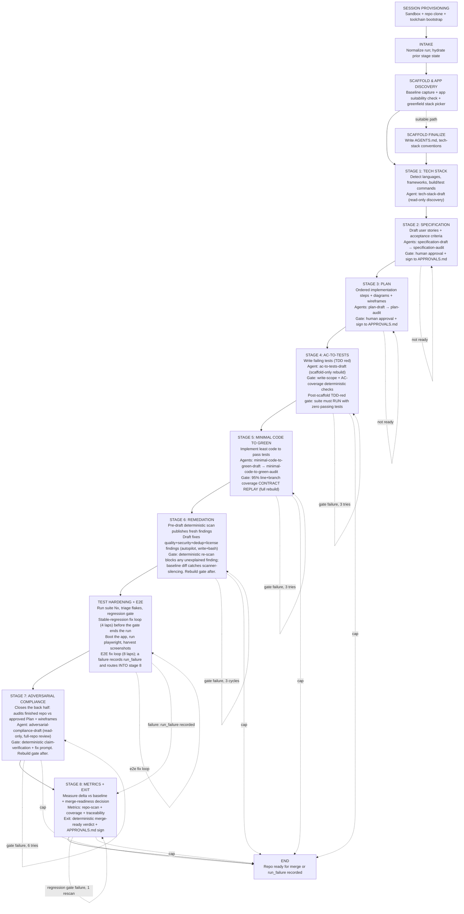
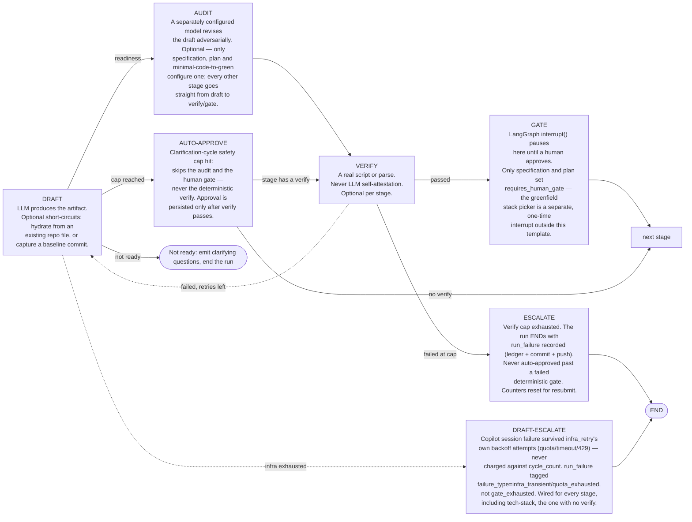

# ai-dev-workflow

A human-gated, LLM-driven software delivery pipeline built as a single [LangGraph](https://langchain-ai.github.io/langgraph/) state graph. Every stage drafts an artifact and runs a *deterministic* check (a real script or parse — never LLM self-attestation). Exactly three stages get an adversarial second-model audit (specification, plan, minimal-code-to-green); exactly three pause for a human by default (tech-stack, specification, plan) — the tech-stack pause is skipped once a repo carries an approved sidecar, and a greenfield (no existing app) repository gets a stack picker at that same pause. Every other failure ENDs the run with a `run_failure` record instead of waiting on a person. All work happens inside a per-session sandbox container holding a clone of the target repo/branch.

- Graph definition: [agent/src/graph.py](agent/src/graph.py)
- Frontend (AG-UI / CopilotKit): [src/](src/)
- Plan of record: [docs/PLAN.md](docs/PLAN.md)

---

## The whole graph: 8-stage pipeline

Clean sequential flow from intake through 8 stages, each integrating custom agents from agent files. Human pauses at tech-stack, specification and plan. Every stage from specification onward carries a deterministic verify (spec ledger, plan diagrams, AC coverage, coverage-contract replay, remediation re-scan, adversarial claim-check, exit readiness) — never LLM self-attestation.



## Every file this pipeline writes into a target repo

| Path | Written by | Purpose |
|---|---|---|
| `AGENTS.md` | scaffold finalize, tech-stack | Cross-tool agent guidance. Created only if absent; an existing one is never overwritten, only appended to (one sentinel-guarded paragraph pointing at `.ai-dev-workflow/tech-stack.md`, plus one per detected ecosystem). |
| `.github/copilot-instructions.md` | scaffold finalize | Thin pointer to `AGENTS.md`. Created only if absent. |
| `.ai-dev-workflow/manifest.json` | brownfield-baseline, app discovery, exit, scaffold finalize | Onboarding state, accepted app record, run summary, and the `toolchain` record. Co-owned — every writer goes through one read-modify-write helper. |
| `.ai-dev-workflow/tech-stack.md` | tech-stack | The detected stack, rendered. **This is the file `AGENTS.md` tells every agent to read first.** |
| `.ai-dev-workflow/tech-stack.approved.json` | tech-stack | Typed sidecar. Its presence is what makes a later run skip detection entirely. |
| `.ai-dev-workflow/raw-requirements.md`, `specification.md`, `plan.md` | record raw requirements, specification, plan | The reviewed artifacts (raw requirements are recorded verbatim, never redrafted). |
| `.ai-dev-workflow/spec/ledger.json` | specification verify | Permanently stable US/AC ids — the sync target for every later traceability check. |
| `.ai-dev-workflow/plan/diagrams/*.{mmd,svg}` | plan verify | Rendered Mermaid diagrams. |
| `.ai-dev-workflow/plan/wireframes/*.html` | plan verify | Self-contained HTML wireframes (UI plans only) — open directly in a browser. |
| `.ai-dev-workflow/coverage-commands.json` | minimal-code-to-green | The coverage contract: per-stack command + artifact + format. Written by the draft, REPLAYED by the coverage gate — the gate deletes artifacts and re-runs each command itself, so the number is always machine-derived. |
| `.ai-dev-workflow/ledger.jsonl` | every node | Per-session action log, including token usage and toolchain installs. Reset each session. |
| `.ai-dev-workflow/quarantine/<run_id>/...` | ac-to-tests write-scope gate | A copy of any file the gate classified as an out-of-scope write, kept before it reverts the original — preserves evidence for a language this gate's test-path regex doesn't recognize, instead of silently deleting the model's work. Part of the same committed audit trail as everything else under `.ai-dev-workflow/`. |
| `.ai-dev-workflow/repo-scan-baseline.json` | repo scan baseline | The repository as it arrived, measured once and never re-measured. Delete it to force a re-baseline. |
| `.ai-dev-workflow/repo-scan-latest.json` | metrics-report | The same shape at the end of the run: deduplicated findings with severity, location, CVE and fix version, plus size/complexity/duplication/churn metrics and a health score. Findings carry no tool attribution — which tool found what lives in the report's `tools[]` run-health block. |
| `.ai-dev-workflow/repo-scan-delta.json` | metrics-report | Baseline versus latest: fixed, introduced, persisted, severity changes, and per-metric direction. Omitted, not faked, when no baseline exists. |
| `.ai-dev-workflow/metrics-latest.json` | metrics-report | The scan and its delta, plus coverage, traceability and token totals. |
| `<solution-root>/Directory.Build.props` | tech-stack | .NET analyzers + `TreatWarningsAsErrors`. |
| `<python-root>/ruff.toml`, `<python-root>/mypy.ini` | tech-stack | Shared ruff + mypy baseline. |

The last two rows exist for one reason: an LLM reliably fixes what a deterministic tool *refuses to accept*, and treats everything else as advice. Each config is paired with a build command that fails on violation (see the R · REBUILD boxes above), which is what turns a lint finding into work the agent must complete.

Node/TS gets the same enforcement **without any file or dependency landing in the repo**: the ESLint toolchain (config + pinned plugins) is baked into the sandbox image at `/opt/aidw/lint` and the full-scope rebuild gates run it from there. Installing lint devDependencies into a target repo is a mistake this pipeline made once — the root install re-resolved a pnpm workspace's peer graph, forked `drizzle-orm` into two incompatible peer-variant instances, and broke the repo's own build.

Two caveats worth stating rather than burying:

- **Severity is not uniform across ecosystems.** .NET stays at `AnalysisLevel=latest-recommended`, the setting already in production use. Node/TS (`typescript-eslint` strict) and Python (`mypy --strict`) start stricter. The strict lint/typecheck gates therefore run only at the full-scope R placements (post-codegen), where the fixer may refactor anything — the scaffold-only placement gates on compilation alone.
- **A repo that lints its own way keeps its own lint contract.** Any ESLint config of the repo's own (any `.eslintrc*`, any `eslint.config.*`) makes the pipeline defer entirely — the image-baked config only ever applies to repos with no lint setup at all.

A file already present and not written by this pipeline is left alone. Our own files carry a version stamp in their header and are replaced when the bundled template moves forward; a file without that header is treated as human-authored.

## The sandbox filesystem

The image is immutable and deliberately small, so a repo needing a toolchain it doesn't ship installs one at runtime — never into the source tree.

| Path | Contents | Lifetime |
|---|---|---|
| `/workspace/repo` | the clone | the session. Never a mount target. |
| `/opt/aidw/tools` | mise-installed SDKs and anything else on `PATH` | the session — an executable on `PATH` is what would carry an attack between two sessions, so it is never shared |
| `/opt/aidw/cache` | npm / NuGet / pip / uv / mise download caches | a named Docker volume per repo **owner** (`aidw-cache-<owner>`) |

Both `/opt/aidw` paths are created and declared in the image itself, so a container behaves identically with or without the volume attached — the mount is an accelerator, never a correctness dependency. On Azure ACI the cache is an Azure Files share and is **off unless `AIDW_CACHE_SHARE` is set**: SMB's many-small-file throughput is poor enough that the cache can be slower than re-downloading, so it gets enabled after measurement.

[agent/sandbox-image/bootstrap.sh](agent/sandbox-image/bootstrap.sh) runs after the clone and after the git credentials are destroyed. It installs only what the repo declares for itself (`.tool-versions`, `mise.toml`, `.nvmrc`, `.node-version`, `global.json`), only from mise's own registry — a config naming an arbitrary plugin git URL is refused, since that is third-party shell that would otherwise run automatically before anything else in the container. Failure is never fatal: a missing toolchain surfaces later as a real build error, which beats a container that refuses to start. `apt-get` at runtime is impossible by construction (the container runs as non-root `vscode`); a genuine OS-package need is a `BASE_IMAGE` change.

What it found is recorded three ways: `.ai-dev-workflow/manifest.json`'s `toolchain` key (durable per repo, rewritten only when the tool set actually changes, and used for a warm start next run), `.ai-dev-workflow/ledger.jsonl` (this run's install metrics), and a host-side `agent/agent-work/toolchain.jsonl` (`$AIDW_TOOLCHAIN_LOG`). The host-side log is the one that answers "what should the next image ship" — commits are pushed to the single `ai-dev-workflow` work branch at every stage end, so the in-repo copy survives the container.

## The stage template every box shares

Most of the boxes above are the same generated subgraph, built from one `StageSpec` entry in [agent/src/graph.py](agent/src/graph.py). Adding a stage means adding a spec, not rewiring the graph.

Every LLM prompt in the pipeline is an editable markdown file under [agent/src/prompts/](agent/src/prompts/) — see its README for the file-to-stage index. Edit a prompt, restart the agent, done (prompts are cached at first load).



Cross-cutting behavior that is not drawn above, because it happens in nearly every node: state is persisted to the sandbox repo and committed after each audit, verify and gate — and every successful commit is pushed to the single, repo-shared `ai-dev-workflow` work branch on origin (`--force-with-lease`, not plain `--force` — WS0's single-branch migration means every session/user on a repo shares this one branch, so a losing race is rejected instead of silently overwriting another session's already-pushed commits; a failed push is logged, surfaced in the UI via streamed `last_push` state, and never blocks the run). Generated source code is committed separately (`git add -A`) at every green rebuild and after each quality/security/dependency fix round, so the pushed branch always carries the code, not just the artifacts. Every LLM node appends a ledger entry with its token usage; a fresh run always re-enters at `intake`, abandoning any interrupt a previous run left open. Each of those code commits also kicks a display-only background full-profile scan, collected non-blocking at the next node boundary, so the metrics bar (including its running $ Cost chip, re-summed from the ledger) tracks the code as it churns instead of going stale between the gate scans — the gates' own scans stay authoritative.

---

## Headless runner (full pipeline, no UI)

Run the entire graph programmatically for a repo/branch — spec and plan auto-approve, clarifying
questions are disallowed (drafts are told to make and record assumptions), a greenfield repo's
tech-stack picker auto-selects via `--greenfield-stack`/`AIDW_GREENFIELD_STACK` instead of pausing
(rejected instead if neither is set, since headless has no interrupt to answer), and any failure
ENDs the run with `run_failure` in the JSON report:

```bash
cd agent && uv run python run_headless.py <owner> <repo> <branch> --requirements-file req.md
```

Needs `GITHUB_TOKEN` (Copilot) and `E2E_GITHUB_TOKEN` (clone + push — must have push scope) in the
root `.env`. Writes a JSON summary to `agent/agent-work/headless-<thread>.json`; exit code 0 only
when the exit stage approved. Expect hours of wall time and real Copilot spend for a full run.

---

## E2E test mode (bypassing GitHub OAuth + MFA)

Automated browser tests cannot complete the real GitHub sign-in (OAuth + MFA). For local end-to-end testing only, set both:

```bash
AIDW_E2E_MODE=1            # activates the bypass; hard-refused when NODE_ENV=production
E2E_GITHUB_TOKEN=<PAT>     # classic PAT with `repo` read on the target repos
```

With E2E mode active: the middleware ([src/proxy.ts](src/proxy.ts)) stops enforcing sign-in, GitHub API routes fall back to the PAT ([src/lib/e2e.ts](src/lib/e2e.ts)), session provisioning forwards the PAT as the sandbox clone credential under the synthetic identity `e2e-user`, and a warning is logged at startup. Playwright can then drive `/select` → `/workflow/...` directly. Both variables default to off; the guard is conjunctive with the production check in every consumer.

---

## Migration: single `ai-dev-workflow` branch per repo

Sessions used to work on a per-session branch, `ai-dev-workflow/<selected-branch>-<session
prefix>` -- one branch per repo+branch+user, so two sessions could never collide. As of this
migration every session on a repo shares a single `ai-dev-workflow` branch instead; the branch
picker in the UI is now a PR-target selector (where the pipeline's work eventually merges to),
not part of a session's identity (`deriveThreadId` in
[src/lib/workflow-thread.ts](src/lib/workflow-thread.ts) keys threads by repo+user only).

Legacy `ai-dev-workflow/<branch>-<prefix>` branches, and the sandbox containers/volumes that were
attached to them, become invisible to the tool the moment this migration lands: nothing reads,
writes, or reaps them anymore. Clean up orphaned pre-migration state by hand:

```bash
# Local Docker: sandbox containers and their workspace volumes (both pre- and post-migration
# sessions share this naming, so check `docker inspect <name>` before removing one you're unsure
# about -- REPO_BRANCH in its env tells you which scheme provisioned it)
docker ps -a --filter name=ai-dev-workflow-sandbox-
docker volume ls --filter name=aidw-ws-

# GitHub: the old per-session branches themselves -- this naming pattern is unique to the
# pre-migration scheme, so everything matching it is safe to delete once merged/abandoned
git ls-remote --heads origin 'ai-dev-workflow/*'
```

---

## Copilot session lifecycle

One Copilot SDK session per `(thread_id, stage, role)`, cached in module-level dicts in
[agent/src/copilot_chat_model.py](agent/src/copilot_chat_model.py) -- roughly 19-26 of them on a
full run. They are deliberately **not** shared between stages: each `(stage, role)` can run a
different model, and an audit that shared the drafter's transcript would read the drafter's own
reasoning and self-justifications instead of reviewing its output independently.

Those caches are process-global and are not keyed by run, so something has to evict them. Four
distinct paths do, and each covers a case the others structurally cannot:

| When | Mechanism | Why not one of the others |
|---|---|---|
| Run reaches a genuine terminal | `close_thread_session` from `exit_nodes.exit_finalize_node` (success), `graph.make_escalate_node` (failed deterministic gate), and `graph.make_draft_escalate_node` (draft-level infra exhaustion) | Graceful: awaits `disconnect()`, which preserves on-disk session state |
| Verify lap stalls (near-identical feedback / zero new changes, `VERIFY_STALL_LAPS` consecutive laps) | `close_session` (`graph.py`'s `make_verify_node`) | Same self-reinforcing shape as a fabrication reset, just not one of the three named patterns — see `infra_retry.py`'s module docstring |
| Container destroyed | `forget_thread_sessions` from `sandbox.registry.pop` | The idle reaper fires ~30 min later with no stage on the stack, so nothing unwinds and no `finally` can run |
| Unhandled node exception | `forget_thread_sessions` from `telemetry.traced_node` | An exception aborts the whole graph invocation, so neither terminal node above ever runs |
| A stage's history is poisoned | `close_session` (fabricated-work retries, `graph.py`) | Targets one `(stage, role)`, not the whole thread |

Two things here are easy to get wrong:

- **`forget_thread_sessions` is sync and network-free on purpose**, which is why it is not
  `close_thread_session`. Once the container is gone, `session.disconnect()` and
  `client.__aexit__()` are calls to a dead endpoint that only block until their timeout --
  "cleaning up" there converts a stale-handle bug into a hang.
- **`registry.pop` is the choke point for container destruction**, but not the *only* destruction
  path. The PR-target-change reprovision in both providers stops the container without popping the
  registry (the entry is overwritten moments later), and the replacement gets a new host port --
  or a new IP on ACI -- so those branches evict the Copilot sessions directly.

Two paths deliberately do **not** clean up, and both are load-bearing. `needs_clarification ->
END`: the user is about to answer the model's own question, so that stage's conversation
continuity is wanted. And `GraphBubbleUp` inside `traced_node` -- a gate interrupt is control
flow, not a failure, so it is re-raised before the eviction above. Inverting either one would
silently destroy a stage's context every time it pauses for human approval.

Self-check: `cd agent && uv run python -m src.copilot_chat_model`. It must be run through the
package name (as `-m` does) rather than by file path -- loading the module as `__main__` makes
`registry.pop`'s deferred import pull in a second copy with its own caches.

---

## Keeping this diagram current

The diagram is generated by hand but guarded automatically. [.claude/hooks/graph-diagram-check.mjs](.claude/hooks/graph-diagram-check.mjs) hashes every file that defines the graph — `graph.py`, the node-cluster modules, `agent/src/gates/`, and `agent/src/prompts/` — and stamps that hash into this README. Two hooks in [.claude/settings.json](.claude/settings.json) run it:

- **PostToolUse** (after any edit) — injects a note telling Claude the diagram is stale.
- **Stop** (before the turn ends) — blocks the turn while the diagram is still stale, so it does not get forgotten.

After updating the diagram, re-stamp it:

```bash
node .claude/hooks/graph-diagram-check.mjs --stamp
```

<!-- graph-source-sha256: f7585c3f99dd5875be5c031c635496de82d34df6302842124e158920a87a5c2e -->
