# AI Dev Workflow: Full SDLC Pipeline + Agent Plugin Infrastructure

> **This file is the canonical design plan for the AI Dev Workflow project**, written during
> plan-mode design and updated during implementation to track status. Status markers below reflect
> the state of the codebase as of the last update to this file, not necessarily "done means
> shipped to `main`" — see each marker's own note for what was actually verified.
>
> **Status legend**
> - ✅ **DONE** — implemented and verified end-to-end against a real Docker sandbox + live Copilot CLI session.
> - ✅ **DONE (not e2e-verified)** — implemented and compiles/wires cleanly, but not yet exercised against a real sandbox run.
> - 🟡 **PARTIAL** — some of the piece exists; see the note for what's missing.
> - ⬜ **NOT STARTED** — nothing built yet.
> - ⚠️ Also see [Known Issues](#known-issues) at the bottom.

## Implementation status at a glance

| Area | Status |
|---|---|
| Part A — Agent Plugin Infrastructure (Phases A0–A6) | ✅ **DONE** |
| Shared pipeline infra (`StageSpec` extensions, `repo_files.py`, `git_ops.commit_paths`, `run_id`) | ✅ **DONE** |
| P0 — Tech-stack detection | ✅ **DONE** (verified e2e) |
| P0 — Brownfield-baseline reverse-engineering | ✅ **DONE (not e2e-verified, structural)** |
| P1 — Raw requirements | ✅ **DONE** (verified e2e twice — two real bugs found and fixed, both fixes reconfirmed against a real sandbox) |
| P2 — Specification: stable-ID ledger + `APPROVALS.md` signing | ✅ **DONE (not e2e-verified)** |
| P3 — Plan: diagrams (Mermaid render) | ✅ **DONE, verified e2e** — sandbox image rebuilt, real SVG render confirmed as the `vscode` runtime user |
| P3 — Plan: wireframes (Excalidraw MCP) | ✅ **DONE (not spike-verified)** — wired via `session_options`, gated on `_tech_stack_has_ui_framework`; mechanism confirmed real (Playwright spike), Excalidraw's own MCP server package not individually spike-tested |
| R — Clean & rebuild node | ✅ **DONE (not e2e-verified)** — wired into `build_graph()` at 5 placements: after P4, after P6, inside P8's chain, inside P10's chain, inside P11's chain |
| P4 — AC-to-tests + write-scope gate | ✅ **DONE (not e2e-verified)** — wired in, never run |
| P6 — Minimal code to green + coverage gate | ✅ **DONE (not e2e-verified)** |
| P8 — Code quality scan/triage/fix loop | ✅ **DONE (not e2e-verified, structural only — see its own section)** |
| P10 — Code security scan/triage/fix loop | ✅ **DONE (not e2e-verified, structural)** |
| P11 — Adversarial audit + dedup + upgrades + license audit | ✅ **DONE (not e2e-verified, structural)** |
| P13 — Full test suite + flake quarantine | ✅ **DONE (not e2e-verified, structural)** |
| P14 — Deterministic metrics + traceability + token tracking | ✅ **DONE (not e2e-verified, structural)** |
| P15 — Exit (finish branch + manifest/changelog) | ✅ **DONE (not e2e-verified, structural)** |
| Frontend — gate label ordered lookup | ✅ **DONE** |
| Frontend — hide `audit_findings` from UI | ✅ **DONE** |
| Frontend — Requirements tab repointed to P1 stage state | ✅ **DONE** |
| Frontend — repo browser redesign (search filter, no virtualization lib -- see note) | ✅ **DONE** |
| Frontend — auto-trigger run on workflow page mount | ✅ **DONE** |
| Frontend — Session Overview panel | ✅ **DONE** |

---

## Context

Two tracks in this plan:

**Part A — Generic Agent Plugin infrastructure.** The sandbox containers (`agent/sandbox-image/`) run GitHub Copilot CLI headless (no Claude Code CLI anywhere in this runtime). This part builds a portable plugin (skills + MCP servers + slash commands only — no hooks/LSP/background monitors) that's dogfoodable in Claude Code and bakes into the sandbox image for Copilot CLI. It vendors the `obra/superpowers` skill pack (confirmed to officially support GitHub Copilot CLI as a target platform), plus `ponytail`, `caveman`, and `security-review` (Phase A6), and ships a first-party `ai-dev-workflow` custom skill pack authored via skill-creator.

**Part B — Full SDLC Pipeline (P0–P15).** The complete re-orientation of "AI Dev Workflow" around a 16-stage pipeline: pre-flight baseline → raw requirements → specification → plan → tests → minimal code to green → quality → security → refactor/adversarial lookback → full test suite → metrics → exit. **Architecture principle, the single most important design decision in this plan**: Superpowers is the process spine (its skills are named explicitly inside stage prompts, per the "reliable enough in practice" invocation pattern already established — skills are never force-invoked via the SDK, which has no such mechanism). Gaps are filled by (a) the custom `ai-dev-workflow` skill pack, (b) MCP/CLI tools (scanners, Playwright, diagram renderers), and (c) **deterministic gate scripts run by the LangGraph harness, never by model obedience** — anything with a number in it ("95% branch coverage," "zero findings severity low or above," "no ID reuse") is a shell/Python script whose exit code blocks the graph edge, never an instruction the model could rationalize past. Copilot's default is **read-only** (`excluded_tools` blocks write/shell tools) for analysis/drafting/triage stages; a revised, relaxed policy (see "Write-access tiers" below) lets Superpowers-named stages write directly under `/docs/**`, and a small explicit set of codegen/fix-application stages get full write access ("agent mode").

Part B's `tech-stack`/P0 stage has a real build-order dependency on Part A (its skills must be vendored/authored and wired first). Otherwise these tracks are independent.

**Sandbox provisioning model, decided**: one dedicated container per session (`SandboxProvider.provision()`, keyed by `thread_id`), each running its own `copilot --server` and cloning to a fixed `/workspace/repo` — this is the model already implemented and the one to keep. A session-pooling/shared-container alternative was considered and explicitly rejected in favor of this simpler, better-isolated per-session-container approach; not pursued further.

---

# Part A — Generic Agent Plugin Infrastructure

**Status: ✅ DONE — all of Phases A0 through A6 complete.** Real Docker build + live Copilot CLI session verification for the loading mechanism (Phase A0); all 7 first-party skills authored and evaluated with real with-skill/baseline subagent comparisons; all 4 vendored packs copied with license-boundary checks and live-loaded verification (model listed all skills back correctly).

## Verified facts

- `agent/sandbox-image/Dockerfile`'s build context is `agent/sandbox-image/` itself (`.github/workflows/build-sandbox-image.yml`: `working-directory: agent/sandbox-image` then `docker build ... .`). Any `COPY` source must live inside that directory.
- That workflow's path trigger is already `agent/sandbox-image/**` — new content anywhere under that tree already triggers an image rebuild; no workflow edit needed.
- `agent/.dockerignore` excludes `sandbox-image` from the agent service's own image — the agent process has no filesystem access to plugin content at runtime; the in-container plugin path must be a static, hand-maintained constant on the agent side (matching the existing `WORKSPACE_DIR_IN_CONTAINER` pattern in `agent/src/sandbox/local_docker.py`).
- `agent/src/copilot_chat_model.py::_get_session()` (lines 172-197) calls `client.create_session(on_permission_request=..., on_exit_plan_mode_request=..., model=..., streaming=True)` — no `plugin_directories`/`skill_directories`/`mcp_servers`/`available_tools`/`excluded_tools` passed today. This is the single call site to extend.
- Copilot SDK (`agent/.venv/Lib/site-packages/copilot/client.py`) confirmed real: `mcp_servers`, `skill_directories`, `plugin_directories`, `instruction_directories`, `disabled_skills`, `disabled_mcp_servers`, `custom_agents`, `available_tools`, `excluded_tools` (`client.py:2028-2029`, `2119-2127`: "Applies to all tools including custom tools registered via `tools=`... Ignored if `available_tools` is set"), `hooks: SessionHooks` with `on_pre_tool_use: PreToolUseHandler` (`session.py:1080-1083`, `823-845`) — a genuine per-tool-call interception point receiving `{sessionId, workingDirectory, toolName, toolArgs}`, able to return `{"permissionDecision": "deny", "permissionDecisionReason": ...}`. `session.send(..., agent_mode: Literal["interactive","plan","autopilot","shell"])` — `"autopilot"` is the real write-access mode. Each added to the outgoing JSON-RPC payload only `if truthy` — unset/empty is a clean no-op.
- Confirmed via web fetch: `obra/superpowers` officially lists GitHub Copilot CLI as a supported install target (alongside Claude Code, Cursor, Devin, Gemini CLI, etc.) — this is not a stretch of the Agent Skills format, it's an explicitly supported use case. Its skill roster: `brainstorming`, `writing-plans`, `executing-plans`, `subagent-driven-development`, `test-driven-development`, `using-git-worktrees`, `requesting-code-review`, `receiving-code-review`, `systematic-debugging`, `verification-before-completion`, `finishing-a-development-branch`, plus meta skills (`using-superpowers`, `writing-skills`).
- `agent/src/config.py` is the existing convention for simple env-var-backed constants.
- `LocalDockerProvider.provision()` (`agent/src/sandbox/local_docker.py:72-130`) accepts an `image: str | None` override, useful for a spike image without touching `DEFAULT_IMAGE = "ai-dev-workflow-sandbox:latest"`.
- Claude Code plugin shape: plugin root needs `.claude-plugin/plugin.json`, plus root-level `commands/*.md`, `skills/<name>/SKILL.md`, `.mcp.json`. A local marketplace is a `.claude-plugin/marketplace.json` with a `plugins` array of `{"name", "source": "./relative/path"}` entries, installable via `/plugin marketplace add <local-path>`.
- No existing plugin/skill scaffolding for this purpose anywhere in the repo. `.claude/` is empty. The top-level `skills/` directory is the developer's own unrelated reference docs for building this app — do not reuse.

## Decisions already made

1. Deliver plugin content by baking it into the sandbox Docker image (no runtime injection via `exec_in_sandbox`).
2. Also set up a local Claude Code marketplace for dogfooding before content ships to the sandbox.
3. **Neither first-party nor vendored skills ever write to the filesystem by default.** Copilot stays read-only for every analysis/drafting/triage stage across the whole P0–P15 pipeline, enforced via an **`available_tools` allowlist** (confirmed by Phase A0's spike to be the robust mechanism — a blocklist via `excluded_tools` was tested and found incomplete, since the model can reach for any of several different built-in write-capable tools; see Phase A0's findings). A small, explicit set of codegen/fix-application stages (P4 test-authoring, P6 codegen, P8/P10 fix-application, P11 refactor/upgrade) get real write access. Skills exist purely to improve the quality of what Copilot returns or (for write-capable stages) how it edits — never to perform actions unilaterally.
4. **No forking/patching of vendored skill content, ever.** 3rd-party skills (Superpowers, or anything vendored later) that hardcode their own "save to `/docs/...`" output instructions in `SKILL.md` prose are neutralized entirely at the calling stage's harness level (the `available_tools` allowlist + a prompt-level override instruction — see Part B's Architecture section), never by editing the vendored files. This avoids the fork-and-reapply-patches maintenance burden.
5. This plan ships three skill families: (a) the vendored `obra/superpowers` pack, (b) three additional vendored single-purpose skills — `ponytail` (code/doc minimization), `caveman` (output-token reduction), `security-review` (reasoning-based vulnerability analysis) — all in Phase A6, and (c) a first-party `ai-dev-workflow` custom skill pack (Phase A4): `tech-stack-conventions`, `preflight-baseline`, `spec-sync`, `ac-to-tests`, `quality-triage`, `security-triage`, `license-audit` — one per stage that benefits from smarter analysis guidance, each authored via `skill-creator`, each analysis-only by default (no writes), except where the "Write-access tiers" section below grants docs-scoped write access.
6. **Write-access tiers** (three, not two — mechanism confirmed/corrected by Phase A0's spike): (i) **read-only** — `available_tools=["builtin:view","builtin:grep","builtin:glob","builtin:task_complete","builtin:ask_user","builtin:skill"]` (an **allowlist**, not a blocklist — testing showed `excluded_tools` blocklisting write-capable tools is incomplete, since the model can reach `create`/`bash`/`edit`/`apply_patch` interchangeably; `available_tools` closes this properly), the default; (ii) **docs-scoped write** — the read-only allowlist above plus `builtin:create`/`builtin:edit`/`builtin:apply_patch` (write-capable tools) but **not** `builtin:bash` (no shell, so no redirection escape route), combined with a `pre_tool_use_hook` (confirmed to fire on every tool-call attempt, useful for logging/telemetry) + deterministic post-hoc diff check restricting the actual written paths to `docs/**` — applied to every stage that names a Superpowers skill known to want to produce supplementary documentation (brainstorming notes, review writeups, PR descriptions) — this relaxes the original "Copilot never writes" rule specifically for Superpowers-authored content, accepted per explicit direction, scoped to `/docs` so it can never touch source/config/test files; (iii) **full write** — `agent_mode="autopilot"` (confirmed to grant real write access) with no `available_tools` restriction, for genuine codegen/fix-application stages (P4 test-scoped — plus its own path-scoped diff gate, P6, P8/P10 fix nodes, P11b/c, R's fix nodes).

## Proposed layout

```
agent/sandbox-image/
  Dockerfile
  entrypoint.sh
  .dockerignore                                  # NEW — excludes skill-creator's transient workspace/eval dirs
  README.md                                       # NEW — documents the processes below
  plugins/
    .claude-plugin/marketplace.json               # local marketplace root
    ai-dev-workflow/                               # first-party plugin (plugin root)
      .claude-plugin/plugin.json
      commands/                                    # *.md slash commands (empty initially)
      skills/
        tech-stack-conventions/SKILL.md
        preflight-baseline/SKILL.md
        spec-sync/SKILL.md
        ac-to-tests/SKILL.md
        quality-triage/SKILL.md
        security-triage/SKILL.md
        license-audit/SKILL.md
      .mcp.json                                    # mermaid/Excalidraw/Playwright/SonarQube MCP servers (Part B)
    vendor/
      obra-superpowers/superpowers/                # vendored skill pack (Phase A6)
      vendor-lock.json
```

One `plugins/` directory is both the Docker `COPY` source and the local Claude Code marketplace root — what's dogfooded in Claude Code is byte-identical to what ships into the sandbox.

## Phase A0 — Validation spike — **DONE, findings below**

**Status: ✅ DONE.**

Ran against a real local Docker build (`ai-dev-workflow-sandbox:spike`) and a real Copilot CLI session via `RuntimeConnection.for_uri`, using a standalone throwaway script rather than editing `copilot_chat_model.py` (cleaner — zero risk of a forgotten revert to production code). All spike artifacts (Dockerfile edit, `plugins/_spike/`, container, image) have been reverted/removed; nothing from this phase reached `main`.

**1. `plugin_directories` — confirmed working, exactly as designed.** Pointing at the plugin *root* (`/opt/ai-dev-workflow-plugins/_spike`, containing `.claude-plugin/plugin.json` + `skills/spike-skill/SKILL.md`) correctly loaded the skill: a prompt containing "banana pajama trigger" produced exactly `PLUGIN_LOADED_OK`. Negative control (same prompt, `plugin_directories` unset) correctly did *not* trigger — confirms this isn't a lucky hallucination. Phase A2/A3's design (COPY to `/opt/ai-dev-workflow-plugins/`, pass the plugin-root path) is validated as-is, no changes needed.

**2. `excluded_tools`/`available_tools` — real correction to the plan, found via testing, not guessing.** Tool filter entries are **source-qualified strings** (`"builtin:<name>"`, `"mcp:<name>"`, `"custom:<name>"` — confirmed in `copilot/_mode.py`'s `ToolSet`/`_validate_tool_filter_list`), not bare names like `"write"`/`"shell"` as originally assumed throughout this plan — every occurrence needs updating to the `builtin:` prefix form. Worse, **blocklisting write-capable tools via `excluded_tools` is empirically incomplete**: with `agent_mode="autopilot"`, excluding `builtin:create` alone still let the model write via `builtin:bash` (shell redirection — exactly the gotcha your reference note warned about); excluding `create`+`bash` still let it through via `builtin:edit`; excluding `create`+`bash`+`edit` still let it through via a fourth tool, `builtin:apply_patch`. The real built-in write-capable tool family is at least `{create, bash, edit, apply_patch}` and possibly more — a cat-and-mouse blocklist is not a safe boundary.
   - **Correction adopted plan-wide: use `available_tools` (allowlist), not `excluded_tools` (blocklist), for every "read-only" tier stage.** `available_tools` takes precedence over `excluded_tools` per the SDK's own docs, and testing confirmed it works cleanly: `available_tools=["builtin:view", "builtin:grep", "builtin:glob", "builtin:task_complete", "builtin:ask_user"]` with `agent_mode="autopilot"` produced a clean, complete refusal — *"I don't have a file-writing tool available in this environment (only view, grep, glob, and task_complete)"* — file confirmed absent. This is a closed-by-default allowlist instead of an open-by-default blocklist that has to enumerate every escape hatch.
   - Wherever this plan says `excluded_tools=["write","shell"]` for a read-only stage, read it as: `available_tools=["builtin:view", "builtin:grep", "builtin:glob", "builtin:task_complete", "builtin:ask_user", "builtin:skill"]` (the read-capable/analysis subset — extend this list if a stage's own testing shows it needs another specific read-only tool, e.g. a directory-listing tool distinct from `view`/`glob`).
   - `excluded_tools` is still the right mechanism for the narrower, *scoped*-write-access stages (P4's test-file-only writes) where the goal isn't "no writes at all" but "no writes *outside a specific path*" — but per this finding, P4's write-scope gate should **not** rely on `excluded_tools` alone for enforcement either; its deterministic Layer-2 diff-based check (already designed as the "authoritative" layer, not just a fallback) is what actually has to carry the weight, exactly as originally designed — this finding reinforces why Layer 2 was designed as authoritative in the first place, rather than requiring a design change there.
   - `hooks={"on_pre_tool_use": ...}` **does intercept every attempted tool call** (confirmed — it fired for every tool the model tried, including ones later blocked) but is an *observability* layer, not by itself an enforcement layer independent of `available_tools`/`excluded_tools` — useful for logging/telemetry (and was exactly how the real tool names above were discovered), but `available_tools` is what actually prevents execution.

**3. `agent_mode="autopilot"` — confirmed grants real write access.** A session with no tool restrictions and `agent_mode="autopilot"` successfully created a file with exact requested content. Design as planned throughout Part B (P6, P4's scoped writes, P8/P10/P11's fix nodes) is validated.

**4. Token-usage metadata — confirmed rich and real, no estimate fallback needed.** Session events expose actual measured usage, not just aggregate counts: `SessionUsageInfoData` (`current_tokens`, `token_limit`, `system_tokens`, `tool_definitions_tokens`, `conversation_tokens`) at the session level, and `AssistantUsageData` (`input_tokens`, `output_tokens`, `reasoning_tokens`, `cache_read_tokens`, `cache_write_tokens`, `cost`, `duration`, `model`, plus a `copilot_usage.total_nano_aiu` billing figure) per model call. **Part B's P14 token-consumption tracking design is upgraded from "labeled estimate, pending confirmation" to "real measured values, confirmed available" — the uncertainty caveat in that section is resolved.**

Original spike steps (for reference — all completed): create throwaway spike plugin with a positive-control trigger skill; build a distinctly-tagged image; run a real thread against it; check positive/negative triggering; confirm tool-ID format and write-access behavior; check token metadata; revert everything. All done, as documented above.

## Phase A1 — Plugin + local marketplace scaffold

**Status: ✅ DONE.**

1. Create `agent/sandbox-image/plugins/ai-dev-workflow/.claude-plugin/plugin.json` (`name`, `description`, `author`), empty `commands/` dir.
2. Create `agent/sandbox-image/plugins/.claude-plugin/marketplace.json` listing the `ai-dev-workflow` plugin by relative `source`.
3. Create `agent/sandbox-image/.dockerignore` excluding skill-creator's sibling `*-workspace/`/`evals/` output; add the same patterns to the root `.gitignore`.
4. Dogfood-install: `/plugin marketplace add <repo>/agent/sandbox-image/plugins`, then `/plugin install ai-dev-workflow@ai-dev-workflow-local`.

## Phase A2 — Wire `copilot_chat_model.py`

**Status: ✅ DONE.**

1. Add to `agent/src/config.py`:
   ```python
   COPILOT_PLUGIN_ROOT_IN_CONTAINER = os.environ.get("COPILOT_PLUGIN_ROOT_IN_CONTAINER", "/opt/ai-dev-workflow-plugins")
   COPILOT_PLUGIN_DIRECTORIES = [
       f"{COPILOT_PLUGIN_ROOT_IN_CONTAINER}/ai-dev-workflow",
       f"{COPILOT_PLUGIN_ROOT_IN_CONTAINER}/vendor/obra-superpowers",
   ]
   ```
2. Extend `CopilotChatModel` (new optional fields, all default to today's behavior): `agent_mode: Literal["interactive","plan","autopilot","shell"] = "plan"`, `available_tools: list[str] | None = None` (the primary read-only enforcement mechanism, confirmed by Phase A0), `excluded_tools: list[str] | None = None` (used only for the docs-scoped tier's shell-specifically-excluded case), `pre_tool_use_hook: PreToolUseHandler | None = None`, `mcp_servers: dict[str, MCPServerConfig] | None = None`. All tool-filter entries must be source-qualified (`"builtin:<name>"`, confirmed via `copilot/_mode.py`), never bare names. `_agenerate` passes `session.send(prompt, agent_mode=self.agent_mode, ...)` instead of the hardcoded `"plan"`. `_get_session`'s `create_session(...)` forwards all five plus `plugin_directories=config.COPILOT_PLUGIN_DIRECTORIES if self.sandbox is not None else None`.
3. `get_chat_model_for_thread(...)` gains the same four optional kwargs, threaded through to the constructor. `StageSpec` gains a `session_options: Callable[[GraphState, str], dict[str, Any]] | None = None` hook so a stage's draft/audit node can supply its own `agent_mode`/`excluded_tools`/`pre_tool_use_hook`/`mcp_servers` — `None` preserves current behavior exactly for `specification`/`plan`. **(Implementation note: this ended up taking a second `role: "draft"|"audit"` argument, not just `state`, so P4 could give its audit pass different — read-only — options than its write-capable draft pass. Not anticipated at plan-writing time; added when P4 was built.)**
4. Comment noting any future `resume_session(...)` call must pass the identical `plugin_directories` list.

## Phase A3 — Bake the plugin into the sandbox image

**Status: ✅ DONE** (base plugin-loading layer). **P3's Chromium/mermaid-cli addition to this Dockerfile is ✅ DONE (not e2e-verified)** — see P3 below.

1. In `agent/sandbox-image/Dockerfile`, after `COPY entrypoint.sh ...` and before `USER vscode`:
   ```dockerfile
   COPY plugins/ /opt/ai-dev-workflow-plugins/
   RUN chown -R vscode:vscode /opt/ai-dev-workflow-plugins
   ```
2. No CI workflow edit needed — add one explanatory comment to `build-sandbox-image.yml`.
3. `entrypoint.sh` needs no changes.

## Phase A4 — Author the `ai-dev-workflow` custom skill pack

**Status: ✅ DONE — all 7 skills authored and evaluated.**

All seven skills follow the identical authoring process (`skill-creator`, targeting `agent/sandbox-image/plugins/ai-dev-workflow/skills/<name>/` directly, no separate "move into plugin" step, analysis-only content by default — no write instructions in the skill body, since the calling stage's write-access tier already enforces the actual boundary). Described once; do not re-derive per skill. All are **Collection: [`ai-dev-workflow`](../../..) (this repo, first-party)** — no external URL, since these are authored in-repo, not sourced from a 3rd party.

| Skill | Used by | Guidance content covers | Status |
|---|---|---|---|
| [`tech-stack-conventions`](../agent/sandbox-image/plugins/ai-dev-workflow/skills/tech-stack-conventions/SKILL.md) | P0 | Explore repo → languages/frameworks/package managers/test frameworks/structure; recognize a .NET solution root (common ancestor of `.csproj`/`.sln`); report everything in the calling turn's structured JSON — never writes files itself. | ✅ DONE, used in production P0 stage |
| [`preflight-baseline`](../agent/sandbox-image/plugins/ai-dev-workflow/skills/preflight-baseline/SKILL.md) | P0 (brownfield only) | How to derive an *as-built* spec from ground truth only: ER diagram from actual schema/migrations, stories from routes/endpoints/UI surfaces, acceptance criteria only from *existing passing tests* (an inferred AC with no test behind it is `confidence: low`, never presented as certain). Every derived story tagged `origin: inferred`. | ✅ Authored, ⬜ not yet consumed (P0 brownfield sub-flow not built) |
| [`spec-sync`](../agent/sandbox-image/plugins/ai-dev-workflow/skills/spec-sync/SKILL.md) | P2 | How to reference stable `US-####`/`AC-####.#` IDs correctly when revising: cite the existing id being revised, mark genuinely new stories `new`, never invent/reuse a number — the actual allocation/validation is deterministic Python (§P2), this skill only shapes the LLM's *input* to that determinism. | ✅ DONE, used in production P2 stage |
| [`ac-to-tests`](../agent/sandbox-image/plugins/ai-dev-workflow/skills/ac-to-tests/SKILL.md) | P4 | Judgment on test kind (unit/integration/e2e) per AC shape, how to write a test that actually proves the AC (not tautological), when a UI-relevant AC needs a Playwright skeleton vs. not. | ✅ DONE, used in production P4 stage |
| [`quality-triage`](../agent/sandbox-image/plugins/ai-dev-workflow/skills/quality-triage/SKILL.md) | P8 | Severity calibration per Roslyn/SonarAnalyzer rule family, false-positive heuristics (generated code, test fixtures), when class-level exclusion beats a per-line pragma, what makes a suppression justified vs. a rubber stamp (reject anything under ~15 words with no rule-specific reasoning). | ✅ Authored, ⬜ not yet consumed (P8 not built) |
| [`security-triage`](../agent/sandbox-image/plugins/ai-dev-workflow/skills/security-triage/SKILL.md) | P10 | Exploitability/blast-radius framework per CWE family, a never-suppress rule for secrets (gitleaks findings), dependency-vulnerability upgrade-first bias, evidence bar for a justified suppression (must name the specific precondition that makes exploitation impossible). Works alongside the vendored `security-review` skill (Phase A6) — this one triages/decides, `security-review` finds. | ✅ Authored, ⬜ not yet consumed (P10 not built) |
| [`license-audit`](../agent/sandbox-image/plugins/ai-dev-workflow/skills/license-audit/SKILL.md) | P11 | Classification confidence calibration — flag anything below high confidence rather than guess; dual-licensed/exception-carrying packages are the single most common automated-tool misclassification and must always route to a human decision, never auto-accept. | ✅ Authored, ⬜ not yet consumed (P11 not built) |

Each: interview via skill-creator → draft → test cases → eval-viewer review → iterate → dogfood-verify in Claude Code (already installed via local marketplace) → verify inside a real sandbox via Phase A0's spike technique. Eval workspaces land as the already-excluded sibling `<name>-workspace/` dirs.

Note on link targets: these are relative repo paths, not yet-existing files at plan-writing time (each is created *by* this phase) — they'll resolve once authored. Shown as links now so the master stage table (Part B) and this table use one consistent convention throughout.

**Extending to a new language** (e.g. adding Python-specific conventions alongside .NET's `Directory.Build.props`): extend `tech-stack-conventions`'s own detection instructions to recognize and report the new language, and separately add that language's template + write logic on the Part B/agent side (§P0) — two-sided extension (skill = smarter detection, agent code = the actual write), never a skill-only change, since skills never write.

## Phase A5 — Repeatable process: adding another skill/command/MCP server

**Status: ✅ DONE — process documented in `agent/sandbox-image/README.md`.**

1. **Skill**: run `skill-creator` targeting `agent/sandbox-image/plugins/ai-dev-workflow/skills/<name>/` directly, same pattern as Phase A4.
2. **Command**: add `agent/sandbox-image/plugins/ai-dev-workflow/commands/<name>.md` with required frontmatter — auto-discovered.
3. **MCP server**: add/extend `.mcp.json`; re-run a scoped Phase-A0-style spike specifically for MCP first, since `${CLAUDE_PLUGIN_ROOT}` templating is Claude-Code-specific and unconfirmed for Copilot CLI.
4. Re-dogfood in Claude Code via the installed local-marketplace plugin.
5. Rebuild the sandbox image (or push to `main` under `agent/sandbox-image/**`) — no Dockerfile edit needed.
6. Confirm in-sandbox visibility via Phase A0's spike technique before considering it done.
7. Commit only `agent/sandbox-image/plugins/ai-dev-workflow/**` — never sibling workspace/eval dirs.

## Phase A6 — Vendor four 3rd-party skill packs (+ generic vendoring process)

**Status: ✅ DONE — all 4 packs vendored, recorded in `agent/sandbox-image/plugins/vendor/vendor-lock.json` with real commit SHAs.**

**Vendored skill/collection reference table** (Collection column links to the source repo; Skill column links to the skill's own doc page where one exists):

| Skill | Collection | Used by | Purpose |
|---|---|---|---|
| [`brainstorming`](https://github.com/obra/superpowers/tree/main/skills/brainstorming) | [`superpowers`](https://github.com/obra/superpowers) | P0, P2 | Socratic refinement, digestible-chunk design review. |
| [`writing-plans`](https://github.com/obra/superpowers/tree/main/skills/writing-plans) | [`superpowers`](https://github.com/obra/superpowers) | P3 | Bite-sized tasks, exact file paths, verification steps. |
| [`executing-plans`](https://github.com/obra/superpowers/tree/main/skills/executing-plans) | [`superpowers`](https://github.com/obra/superpowers) | P6 | Batch execution under human checkpoints. |
| [`subagent-driven-development`](https://github.com/obra/superpowers/tree/main/skills/subagent-driven-development) | [`superpowers`](https://github.com/obra/superpowers) | P6 | Fresh subagent per task, two-stage review. |
| [`test-driven-development`](https://github.com/obra/superpowers/tree/main/skills/test-driven-development) | [`superpowers`](https://github.com/obra/superpowers) | P4/P6 (implicit, via the RED-then-GREEN staging) | RED-GREEN-REFACTOR enforcement. |
| [`systematic-debugging`](https://github.com/obra/superpowers/tree/main/skills/systematic-debugging) | [`superpowers`](https://github.com/obra/superpowers) | R (every placement) | 4-phase root-cause analysis on build failure. |
| [`requesting-code-review`](https://github.com/obra/superpowers/tree/main/skills/requesting-code-review) | [`superpowers`](https://github.com/obra/superpowers) | P8 | Pre-review checklist against plan/standards. |
| [`receiving-code-review`](https://github.com/obra/superpowers/tree/main/skills/receiving-code-review) | [`superpowers`](https://github.com/obra/superpowers) | P11a | Adversarial self-critique against feedback. |
| [`verification-before-completion`](https://github.com/obra/superpowers/tree/main/skills/verification-before-completion) | [`superpowers`](https://github.com/obra/superpowers) | P11a | Confirms fixes before declaring success. |
| [`finishing-a-development-branch`](https://github.com/obra/superpowers/tree/main/skills/finishing-a-development-branch) | [`superpowers`](https://github.com/obra/superpowers) | P15 | Merge/PR-readiness decision workflow. |
| [`using-git-worktrees`](https://github.com/obra/superpowers/tree/main/skills/using-git-worktrees) | [`superpowers`](https://github.com/obra/superpowers) | (available, not currently invoked by name in any stage — vendored for completeness) | Isolated workspace on a new branch with a test baseline. |
| [`ponytail`](https://github.com/dietrichgebert/ponytail) | [`ponytail`](https://github.com/dietrichgebert/ponytail) | P2/P3 (tersify), P6, P11a, P14 | Code/doc minimization — see dedicated design below. |
| [`caveman`](https://github.com/JuliusBrussee/caveman) | [`caveman`](https://github.com/JuliusBrussee/caveman) | Selected high-output stages (P0 brownfield, P11a, P15) | Output-token reduction — see dedicated design below. |
| [`security-review`](https://awesome-copilot.github.com/skill/security-review/) | [`github/awesome-copilot`](https://github.com/github/awesome-copilot) | P10 | Reasoning-based vulnerability analysis, complements deterministic scanners — see dedicated design below. |

1. Targets: `agent/sandbox-image/plugins/vendor/obra-superpowers/superpowers/`, `.../vendor/dietrichgebert-ponytail/ponytail/`, `.../vendor/juliusbrussee-caveman/caveman/` (**caveman skill only** — explicitly exclude its browser and proxy components, neither of which are skill content and both of which are irrelevant/inappropriate for a headless sandboxed Copilot CLI session), `.../vendor/github-awesome-copilot/security-review/`.
2. Copy only `.claude-plugin/plugin.json`, `commands/`, `skills/` — strip/reject `agents/`, `hooks/`, `hooks.json`, LSP config, `.mcp.json` (none of these four ship any, but the rule applies generically to any future vendor). For caveman specifically: copy only the `caveman` skill directory itself, explicitly excluding any browser-extension or proxy-server subdirectories in that repo.
3. **No patching of vendored files, ever** (Decisions point 4) — content is copied byte-for-byte, component-type stripping only. This is what makes the relaxed docs-scoped write policy (Decisions point 6) necessary rather than editing a skill's own "save to X" instructions — we accept the path they write to (`/docs`) instead of rewriting their prose.
4. Validation: `plugin-dev:plugin-validator` agent for a one-off interactive review per pack; the repeatable `validate_vendor.py` script (no `agents/`/`hooks/` paths, `plugin.json` parses with a `name`) runs against all four.
5. Record all four in `vendor-lock.json` (name, source repo URL, ref/tag, commit sha, date vendored, vendored by).
6. Register each as its own `marketplace.json` entry; append each in-container path to `COPILOT_PLUGIN_DIRECTORIES` (Phase A2).
7. Update process (any future re-vendor): re-copy+strip+validate against the new ref, bump `vendor-lock.json`, re-dogfood, re-verify via Phase A0's technique before merging.

**Installation note**: `ponytail` and `caveman` both document a native GitHub Copilot CLI marketplace-install path (`copilot plugin marketplace add <org>/<repo>`) alongside Claude Code's — confirms they're built for exactly this dual-target use case, not just Claude Code with Copilot CLI compatibility as an afterthought.

## Critical files (Part A)

- `agent/sandbox-image/Dockerfile`, `agent/src/copilot_chat_model.py`, `agent/src/config.py`
- `agent/sandbox-image/plugins/.claude-plugin/marketplace.json` (new)
- `agent/sandbox-image/plugins/ai-dev-workflow/.claude-plugin/plugin.json` (new)
- `agent/sandbox-image/plugins/ai-dev-workflow/skills/{tech-stack-conventions,preflight-baseline,spec-sync,ac-to-tests,quality-triage,security-triage,license-audit}/SKILL.md` (new, via skill-creator)
- `agent/sandbox-image/plugins/vendor/{obra-superpowers/superpowers,dietrichgebert-ponytail/ponytail,juliusbrussee-caveman/caveman,github-awesome-copilot/security-review}/**` (new, vendored)
- `agent/src/sandbox/local_docker.py`, `.github/workflows/build-sandbox-image.yml` (comment only)

---

# Part B — Full SDLC Pipeline (P0–P15)

## Verified facts

**`agent/src/graph.py`** (read in full):
- `StageSpec` (frozen dataclass): `key`, `response_schema`, `content_field`, `surface_tool_name`, `build_envelope`, `build_prompt`, `max_cycles`, `audit_response_schema`, `audit_content_field`, `build_audit_prompt`, `render_markdown`. `STAGES: list[StageSpec] = [specification, plan]` — these are P2 and P3 respectively; **both already exist and are being extended, not built from scratch.** `build_graph()` wires every stage identically: `{key}_draft → route → {key}_audit → {key}_gate → next stage's {key}_draft (or END)`, plus `{key}_auto_approve`.
- **Module docstring, load-bearing**: "Every run (initial submission or any later revision) enters at `intake` and unconditionally proceeds to the Specification stage's draft node... any interrupt left open from a previous run is never resumed and is abandoned by construction." A gate approval resumes the same paused run via LangGraph's interrupt-resume path (not re-entering `intake`), but every fresh chat submission re-enters `intake` and cascades through the entire stage chain again, relying on each draft node's own idempotency checks to short-circuit cheaply. This governs the ledger's reset boundary and the raw-requirements redraft-on-edit correction (§P1).
- `make_draft_node`/`make_audit_node` call Copilot via `ainvoke_structured(model, prompt, response_schema)` — strict single-JSON-object contract. `make_audit_node` builds and emits an A2UI surface unconditionally via `build_envelope`+`present_surface_messages`, persists. `make_gate_node`: `interrupt({"stage": key, "draft": ...})`. `intake_node`: hydrates from `.ai-dev-workflow/state.json` only when in-memory `stages` is empty AND a sandbox is registered; resets `ready_for_review`/`approved` stages to `not_started` on every fresh run; pulls `raw_requirements_text` from the latest `HumanMessage`.

**`agent/src/workflow_persistence.py`** (read in full): `_stage_file(key, kind)` → `f"{key}.{kind}"`. `_read_file`/`_write_file` operate relative to `WORKFLOW_DIR = ".ai-dev-workflow"`, base64-round-trip via `exec_in_sandbox`. `persist_state()` unconditionally overwrites `raw-requirements.md` on every call — resolved in §P1. `README.md`'s `if _read_file(...) is None: _write_file(...)` is the template for "create if missing" checks. `HydrationError` — loud-failure contract.

**Sandbox/clone**: `/workspace/repo` is the clone destination everywhere. Branch parameterized via `REPO_BRANCH`. Clone happens once at container start; a torn-down/idle-reaped container gets a fresh clone on next provision.

**GitHub API integration** — entirely frontend-side. `GET /api/github/repos` → `{owner, repo, fullName, private, defaultBranch, updatedAt}` (description available but unmapped; no last-commit info — needs a batched GraphQL query). `GET /api/github/branches` → `{branches:[{name}]}`.

**Frontend**: `src/app/select/page.tsx` — dropdowns, `handleContinue()` → pure client nav, no provisioning call. No virtualization library is a direct dependency. `src/components/AppShell.tsx` — `ViewId = "requirements"|"specification"|"plan"`, plain `useState`; the "requirements" tab already is what P1/raw-requirements needs (`RequirementsView.tsx` reads `state.raw_requirements_text`, is the input surface). `SpecificationView`/`PlanView` render via `A2UISurfaceView` → `SpecificationSurfaceRenderer`/`PlanSurfaceRenderer` (`src/a2ui/catalog.tsx`), which currently display `audit_findings` — must be removed (§ frontend fixes — **done**). Gate approval is mechanically stage-agnostic but its displayed label is a binary ternary (`AppShell.tsx` line 42) that must become an ordered lookup (**done**). Session provisioning (`SandboxSessionBoot.tsx`) is automatic on `/workflow/...` mount; the actual graph run only starts on chat submission today.

## `.ai-dev-workflow/` folder convention (canonical layout for the whole pipeline)

```
.ai-dev-workflow/
  manifest.json          # run id, requirements snapshot hash, approval hashes — see "First-run detection" below
  ledger.jsonl            # workflow ACTION log (audit trail of every node's activity), fresh per session
  history/                 # append-only per-run snapshots: <run_id>-metrics.json, <run_id>-ledger-snapshot.json
  questions.md             # pending clarifying questions (P1 loop), cleared after each cycle
  tech-stack.md / .draft.json / .approved.json     # P0
  raw-requirements.md / .draft.json / .approved.json / .seed.txt  # P1
  suppressions.md           # P8/P10 justified-suppression ledger
  sbom.cyclonedx.json        # P10, overwritten each cycle
  p11/license-approvals.json  # P11 human license decisions -- written by verify_license_audit, see P11's own note
  p13/flake-quarantine.json    # P13 [DONE, not verified]
  metrics-latest.json          # P14 convenience pointer [DONE, not verified]
  history/<run_id>-metrics.json, <run_id>-ledger-snapshot.json  # P14/P15 [DONE, not verified]
manifest.json                  # P0/P15 -- run id, hashes, merge readiness [DONE, not verified]
spec/
  ledger.json              # STABLE ID registry (US-####/AC-####.#) — distinct from ledger.jsonl above [DONE]
plan/
  diagrams/                 # mermaid source + rendered SVG [DONE, not verified]
  wireframes/                # Excalidraw exports (UI apps only) [NOT STARTED]
APPROVALS.md                # content-hash-signed approval log (P2/P3/P15) [DONE for all three]
THIRD-PARTY-NOTICES.md       # P11 [DONE, not verified — p11_gates.py::verify_license_audit writes it]
license-policy.json           # allow/review/deny lists, repo-committed, human-editable [not built by this tool -- human-authored input, read by P11's exit gate if present]
traceability-matrix.md         # P14 [DONE, not verified]
CHANGELOG.md                    # P15 [DONE, not verified]
```

> **Note**: `specification`/`plan`'s own draft/approved/md files still live at `.ai-dev-workflow/specification.*` / `.ai-dev-workflow/plan.*` (the pre-existing, already-working location), not the `spec/spec.md` / `plan/plan.md` paths this section of the original plan sketched — a deliberate, pragmatic scope decision made during implementation to avoid migrating already-verified P2/P3 persistence for no functional gain. The spec ledger now lives at `.ai-dev-workflow/spec/ledger.json` (nothing is written outside `.ai-dev-workflow/`).

**First-run/brownfield detection**: the absence of `.ai-dev-workflow/manifest.json` is the canonical signal a project has not used this workflow before — no heuristic guessing. This governs whether P0's brownfield-baseline sub-flow runs at all. **Not yet implemented** — see P0 below.

**Two distinct ledgers, never conflated**: `.ai-dev-workflow/ledger.jsonl` is a workflow *action* log (what every node did, fresh per session, reset at the true entry point of a from-scratch run) — **✅ DONE**. `.ai-dev-workflow/spec/ledger.json` is a stable *ID registry* (`US-####`/`AC-####.#`, monotonic, never reused, `status: active|retired|revised`) maintained across the entire life of the repo's use of this tool — **✅ DONE (not e2e-verified)**.

## Shared infrastructure extensions (prerequisite for every stage below)

**Status: ✅ DONE.**

- **`agent/src/repo_files.py`**: `read_repo_file`/`write_repo_file` on an arbitrary repo-root-relative path, `reset_ledger`, `append_ledger_entry`. ⚠️ See [Known Issues](#known-issues) — shell-quoting gap.
- **`agent/src/git_ops.py`**: `commit_paths(provider, thread_id, paths, message)`. ⚠️ See [Known Issues](#known-issues) — shell-quoting gap.
- **`StageSpec` gained the planned fields, plus two not anticipated at plan-writing time**:
  - `requires_human_gate: bool = True` — ✅ done as designed.
  - `post_audit_hook` — ✅ done, **signature ended up as `(thread_id, content_dict, state, provider)`**, not `(thread_id, content_dict, provider)` as originally planned — the extra `state` parameter was needed so raw-requirements' hook could persist the seed text that produced a draft (see P1 below); tech-stack's existing hook was updated to match.
  - `deterministic_verify` — ✅ done, **signature ended up as `(thread_id, content_dict, run_id, baseline_commit, provider)`**, not `(thread_id, content_dict, provider)` — `run_id` was added for the ledger/approvals systems, `baseline_commit` for P4's write-scope gate.
  - `max_verify_cycles: int = 3` — ✅ done as designed.
  - `hydrate_from_repo_file` — ✅ done as designed.
  - `session_options` — ✅ done, **signature ended up as `(state, role: "draft"|"audit")`**, not just `(state)` — needed so P4's audit pass could be read-only even though its draft pass has real write access.
  - **`capture_baseline_commit: bool = False`** (not in the original plan) — captures `git rev-parse HEAD` once per run, the write-scope gate's diff baseline.
  - **`sign_approval: bool = False`** (not in the original plan as a `StageSpec` field, though the *behavior* was — implements the `APPROVALS.md` hash-signing described in §P2).
- `build_graph()`'s structural changes: ✅ the `{key}_verify`/`{key}_escalate` insertion when `deterministic_verify` is set, and the `scaffold` node between `intake` and `STAGES[0]`'s draft, are both done. **One addition beyond the original plan**: a fourth routing outcome, `"already_approved"`, now exists on the post-draft conditional edge — see the bug note directly below.
- `StageState` gained `verify_cycle_count`, `last_verification`, and (not originally planned) **`baseline_commit`**.
- `intake_node`'s reset loop narrows from `STAGES[1:]` to `STAGES[2:]` — ✅ done (now that both tech-stack and raw-requirements sit before specification, both are exempted from the reset-to-not_started sweep).

### A real bug found and fixed during P1's implementation, worth recording here

When `hydrate_from_repo_file` short-circuits a draft (an idempotent re-run skipping the LLM draft call because the artifact already exists on disk, e.g. tech-stack or raw-requirements on a second run), the **original** routing design still sent control through `audit_node` afterward unconditionally, because the post-draft router only looked at `readiness`, and a hydrated stage sets `readiness=True` same as a freshly-drafted one. This meant every "idempotent" re-run silently re-ran a live, non-deterministic audit LLM call on already-approved content, producing subtly reworded "approved" output and needlessly re-triggering the human gate — defeating the entire point of the hydrate-skip optimization. Caught only by real end-to-end re-invocation testing (comparing a stage's approved content across two runs with unchanged input), not by code review. **Fixed**: `make_route_after_draft` now checks `stage["status"] == "approved"` first (which only a hydrate short-circuit sets directly) and routes straight to the next stage's draft node, bypassing both audit and gate. This affects every current and future stage that uses `hydrate_from_repo_file` — not just P1.

---

## Architecture: the full P0–P15 sub-graph

**Status: ✅ Fully wired end-to-end** (P0's brownfield sub-flow excepted — see below). `STAGES: list[StageSpec]` (not renamed to `PIPELINE: list[StageSpec | RebuildSpec]` as the original plan sketched — see the note below) holds, in order: `tech-stack`, `raw-requirements`, `specification`, `plan`, `ac-to-tests`, `minimal-code-to-green`. `agent/src/rebuild.py`'s `RebuildSpec`/R nodes are wired in at three placements (after `ac-to-tests`, after `minimal-code-to-green`, inside P8's own chain, inside P10's own chain, inside P11's own chain) via a shared `_wire_rebuild` helper. P8/P10/P11c/P13/P14/P15's bespoke node clusters (none of which fit the generic `StageSpec`/`RebuildSpec` templates) are each wired in via their own `_wire_p8`/`_wire_p10`/`_wire_p11`/`_wire_p13`/`_wire_p14`/`_wire_p15` functions, called once from `build_graph()`. **Verified**: every one of the graph's 100 nodes is reachable from `START` (a plain BFS over `compiled.get_graph()`'s edges) — no orphan branches, no dead ends.

**A real, deliberate departure from the original plan, worth recording**: the plan's own architecture section called for restructuring the flat `STAGES` list into `PIPELINE: list[StageSpec | RebuildSpec]`, with `build_graph()` iterating it once. In practice, P11's own bespoke P11c cluster sitting *between* two `StageSpec`-shaped sub-stages (P11a/P11b before it, P11d after) made a single flat ordered list an awkward fit regardless of its element type — so instead, `build_graph()`'s per-stage wiring logic was extracted into a reusable `_wire_stage(builder, stage_spec, next_draft_name)` function (used by both the `STAGES` loop and every standalone `StageSpec` instance like `ADVERSARIAL_AUDIT_SPEC`/`DEDUP_SPEC`/`LICENSE_AUDIT_SPEC`/`EXIT_SPEC`), and each pipeline segment (P8, P10, P11, P13, P14, P15) got its own small `_wire_*(builder)` function called explicitly from `build_graph()`, rather than one big generic iteration over a mixed-type list. Achieves the same goal (every segment is pluggable, nothing hardcoded twice) through explicit composition instead of a single polymorphic list.

**Full pipeline diagram, for review** — color key: rounded rectangles = LLM stage, Copilot **read-only** (`available_tools` allowlist restricts to view/grep/glob-class tools only, structured JSON only); bold-border rectangles = LLM stage with **real write access** ("agent mode"); hexagons = **fully deterministic, no LLM**; stadium shapes = **human gate**. Green = done (not e2e-verified unless stated); dashed grey = not started.

```mermaid
flowchart TD
    classDef readonly fill:#e8f0fe,stroke:#4285f4,color:#1a1a1a
    classDef writecap fill:#fef3e0,stroke:#e8710a,stroke-width:3px,color:#1a1a1a
    classDef deterministic fill:#e6f4ea,stroke:#137333,color:#1a1a1a
    classDef humangate fill:#fce8e6,stroke:#c5221f,color:#1a1a1a
    classDef done fill:#d9ead3,stroke:#38761d,stroke-width:2px,color:#1a1a1a
    classDef notstarted fill:#f4f4f4,stroke:#999999,stroke-dasharray: 5 5,color:#666666

    START(["START"]) --> intake["intake<br/>check .ai-dev-workflow/manifest.json"]

    intake --> p0{{"P0 preflight-baseline<br/>brownfield only<br/>DONE, not e2e-verified"}}:::done
    p0 --> p0gate(["Human ratifies<br/>derived baseline<br/>DONE, not e2e-verified"]):::done
    p0gate --> tsd
    intake -- manifest exists, greenfield/returning --> tsd

    tsd["P0 tech-stack<br/>DONE, verified e2e"]:::done
    tsd --> rrd["P1 raw-requirements<br/>DONE, verified e2e"]:::done
    rrd --> p2d["P2 specification<br/>+ ledger sync<br/>DONE, not e2e-verified"]:::done
    p2d --> p3d["P3 plan<br/>+ diagram render<br/>DONE, not e2e-verified"]:::done
    p3d --> p4["P4 ac-to-tests<br/>+ write-scope gate<br/>DONE, not e2e-verified"]:::done
    p4 --> r1{{"R(P4): clean and rebuild<br/>DONE, not e2e-verified"}}:::done
    r1 --> p6["P6 minimal code to green<br/>DONE, not e2e-verified"]:::done
    p6 --> r2{{"R(P6): clean and rebuild<br/>DONE, not e2e-verified"}}:::done
    r2 --> p8["P8 code quality loop<br/>scan/triage/fix/R/gate<br/>DONE, structural only"]:::done
    p8 --> p10["P10 code security loop<br/>scan/triage/fix/R/gate<br/>DONE, structural only"]:::done
    p10 --> p11["P11 adversarial audit +<br/>dedup + upgrades + license<br/>DONE, structural only"]:::done
    p11 --> p13["P13 full test suite<br/>+ flake quarantine<br/>DONE, structural only"]:::done
    p13 --> p14["P14 metrics + traceability<br/>+ token tracking<br/>DONE, structural only"]:::done
    p14 --> p15["P15 exit<br/>DONE, structural only"]:::done
    p15 --> END(["END"])
```



For the full stage-by-stage mechanical detail (skills invoked, gate types, write-access tiers) of every stage below, see each stage's own section — the master reference table from the original planning doc is preserved as-is further down, with a Status column added.

---

## Master stage reference table

| Stage | Name | Skills invoked (Collection) | Write access | Gate type | **Status** |
|---|---|---|---|---|---|
| **P0** | Preflight baseline (tech-stack) | [`tech-stack-conventions`](../agent/sandbox-image/plugins/ai-dev-workflow/skills/tech-stack-conventions/SKILL.md) ([`ai-dev-workflow`](../agent/sandbox-image/plugins/ai-dev-workflow)) | Read-only | `requires_human_gate=False`, auto-approve after audit | ✅ **DONE** |
| **P0** | Preflight baseline (brownfield) | [`preflight-baseline`](../agent/sandbox-image/plugins/ai-dev-workflow/skills/preflight-baseline/SKILL.md), [`brainstorming`](https://github.com/obra/superpowers/tree/main/skills/brainstorming) | Docs-scoped | Human ratification gate | ⬜ **NOT STARTED** |
| **P1** | Raw requirements | `brainstorming` (superpowers) — see note below | Read-only | None — deterministic pass-through, accepted verbatim (`record_raw_requirements_node`: no draft, no audit, no gate) | ✅ **DONE** |
| **P2** | Specification | [`spec-sync`](../agent/sandbox-image/plugins/ai-dev-workflow/skills/spec-sync/SKILL.md), `brainstorming`, `ponytail` (tersify) | Read-only / docs-scoped | Human approval, hash-signed + deterministic ledger-sync gate | ✅ **DONE (not e2e-verified)** |
| **P3** | Plan | `writing-plans`, `ponytail` (tersify) | Read-only / docs-scoped | Human approval, hash-signed + deterministic diagram gate | ✅ **DONE (not e2e-verified)**, wireframes deferred |
| **R** | Clean & rebuild | `systematic-debugging` (fix node only) | None / full (fix node) | Deterministic exit code, escalate on cap | ✅ **DONE (not e2e-verified)** |
| **P4** | AC to tests | [`ac-to-tests`](../agent/sandbox-image/plugins/ai-dev-workflow/skills/ac-to-tests/SKILL.md), `test-driven-development` | Full, test-files-only (scoped) | Deterministic: write-scope + AC-coverage gate | ✅ **DONE (not e2e-verified)** |
| **P6** | Minimal code to green | `subagent-driven-development`, `executing-plans`, `ponytail ultra` | Full | Deterministic: all tests pass + 95% coverage | ✅ **DONE (not e2e-verified)** |
| **P8** | Code quality | [`quality-triage`](../agent/sandbox-image/plugins/ai-dev-workflow/skills/quality-triage/SKILL.md), `requesting-code-review` | Read-only / docs-scoped / full-scoped | Deterministic: zero unsuppressed errors + no-silent-suppression | ✅ **DONE (not e2e-verified, structural)** |
| **P10** | Code security | [`security-triage`](../agent/sandbox-image/plugins/ai-dev-workflow/skills/security-triage/SKILL.md), `security-review` | Read-only / full-scoped | Deterministic: zero findings severity LOW+, unsuppressed, SBOM present | ✅ **DONE (not e2e-verified, structural)** |
| **P11a** | Adversarial audit | `receiving-code-review`, `verification-before-completion`, `caveman` | Read-only / docs-scoped | `requires_human_gate=False`, auto-approves after draft (no audit leg of its own — this stage IS the audit) — findings feed dedup + the audit exit gate's re-checks | ✅ **DONE (not e2e-verified, structural)** |
| **P11b** | De-dup/simplify | `ponytail ultra` | Full, scoped | `requires_human_gate=False`, objective jscpd re-check | ✅ **DONE (not e2e-verified, structural)** |
| **P11c** | Dependency upgrades | — | Full | Deterministic verify-loop | ✅ **DONE (not e2e-verified, structural)** |
| **P11d** | License audit | [`license-audit`](../agent/sandbox-image/plugins/ai-dev-workflow/skills/license-audit/SKILL.md) | Read-only | Confidence-gated: auto / human | ✅ **DONE (not e2e-verified, structural)** |
| **P13** | Full test suite | — | Deterministic / read-only (triage) | Deterministic: all green + quarantine linked | ✅ **DONE (not e2e-verified, structural)** |
| **P14** | Metrics | `ponytail-gain` | None — no LLM (except ponytail-gain) | N/A (informational) | ✅ **DONE (not e2e-verified, structural)** |
| **P15** | Exit | `finishing-a-development-branch`, `caveman` (PR description) | Read-only / docs-scoped | `requires_human_gate=False`, signed AS-DRAFTED (no second-model audit), then deterministic finalize | ✅ **DONE (not e2e-verified, structural)** |

**Note on P1's skill**: the original plan left P1's assisting skill as "vendored requirements-writing skill (source TBD at Phase A6 execution time)" — an explicitly open item. During implementation, no dedicated 3rd-party requirements-writing skill was vendored; the already-vendored `brainstorming` skill (superpowers) was used instead, since its Socratic-refinement purpose fits P1 well and it avoids adding a new vendor dependency for marginal benefit. A pragmatic resolution of an open item, not a silent scope cut.

**Note on the greenfield stack picker**: not a stage in the original planning doc, so it has no row above — added during implementation (`app_discovery.py`'s `greenfield_stack_select_node`, wired between app-discovery's decide node and scaffold-finalize in `graph.py`). A genuinely blank repository (no manifest, no startable app found) is offered a **Real human interrupt (exceptional)** — pick and edit one of 8 canned tech stacks — instead of the hard rejection every other unsuitable repo gets. Headless auto-selects via `AIDW_GREENFIELD_STACK` instead of ever raising the interrupt; left unset, a blank repo is rejected exactly as before this existed. Outside specification/plan approval, this is the only other real human interrupt anywhere in the pipeline.

No custom **agents** (LangGraph subagents, distinct from skills) are used anywhere in this pipeline — every "fresh subagent per task" reference (P6's `subagent-driven-development`) is a Superpowers *skill* instructing Copilot's own subagent-spawning behavior inside one session.

## Third-party skill integration: ponytail, caveman, security-review

**Status: ✅ DONE, verified live (installation + invocation mechanism), all planned prompt wiring now in place.** Vendored (Phase A6 ✅). Actually invoked by name in prompts where the plan called for it: P6's draft prompt (`/ponytail ultra`), P11b's draft prompt (`/ponytail ultra` + `/ponytail-audit`), P14's `p14_ponytail_gain_node` (`/ponytail-gain`), and now also P2/P3's audit prompts (`ponytail` full, prose fields only) and P0-brownfield/P11a/P15's draft prompts (`caveman` full).

**Live verification, not just static reading** (spike scripts run against a real sandbox container + real Copilot CLI sessions, cleaned up after):
1. **Today's actual wiring — `plugin_directories=` at session-create, no separate install step — works.** A session created with `plugin_directories=config.COPILOT_PLUGIN_DIRECTORIES` (exactly what `copilot_chat_model.py` already does) correctly surfaces all 30 vendored/first-party skills via `session.rpc.skills.list()`, ponytail and caveman included.
2. **A separate, real `client.rpc.plugins.marketplaces.add()` + `client.rpc.plugins.install()` RPC pair also exists** (confirmed real and callable — `PluginsInstallRequest`/`PluginsMarketplacesAddRequest` in the SDK's generated RPC layer, marked experimental) and does install cleanly (ponytail: 6 skills installed, caveman: 1). **But** a fresh session created afterward with no `plugin_directories` does *not* automatically see the globally-installed plugins (`session.skills.list()` came back near-empty) — whatever additional wiring would make that path work wasn't investigated further, since today's simpler `plugin_directories` mechanism already works and is what's live. **Conclusion: no code change needed here** — the architecture concern that prompted this check (does `plugin_directories` actually work, or is the separate install RPC required) is resolved in favor of the status quo.
3. **Ground-truth invocation, via `session.rpc.skills.get_invoked()` (not just the model's own claims)**: the exact current prompt phrasing "Use `/ponytail ultra` discipline" *does* cause the model to invoke the real `ponytail` skill. A natural trigger phrase with the skill never named at all ("this feels over-engineered, give me the simplest solution") *also* triggers it — Copilot CLI's own skill-matching engages on relevant prose, not just on-name/on-command references. `caveman` is invokable the same way (natural trigger and explicit naming both confirmed), even though — until this pass — it was vendored but never referenced in any prompt at all.
4. **Real, separate finding this surfaced**: neither hooks (Claude Code's `SessionStart`-hook-driven auto-activation, the mechanism behind *this very conversation's own* "CAVEMAN MODE ACTIVE"/"PONYTAIL MODE ACTIVE" banners) nor commands (`/ponytail`, TOML-format in the source repo) were vendored into the sandbox image (a deliberate Phase A6 decision, `vendor-lock.json`'s own notes) — Copilot CLI's session hooks (`on_pre_tool_use` etc.) have no session-start/content-injection hook type to begin with, so that mechanism was never available here regardless. Given (3) above, none of that turns out to matter: the skill's own semantic matching plus explicit prompt phrasing both work without hooks or commands.

**[`ponytail`](https://github.com/dietrichgebert/ponytail)** — an AI agent code/doc minimization skill ("the best code is the code you never wrote"): before writing anything, walks a checklist (does this need to exist? already in the codebase? standard library? native platform feature? one line?) before defaulting to a minimum-viable implementation. Measured: ~54% less code generated (up to 94% on over-built features), ~22% fewer tokens, 100% safety-property preservation (validation/security/accessibility untouched). Commands: `/ponytail [lite|full|ultra|off]` (intensity), `/ponytail-review` (diff-scoped), `/ponytail-audit` (whole-repo scan for existing over-engineering), `/ponytail-debt` (collects deferred `ponytail:` shortcuts), `/ponytail-gain` (benchmark scorecard).
- **P6 (minimal code to green)**: `/ponytail ultra` set at session start.
- **P11b (de-dup/simplify)**: `/ponytail-audit` alongside jscpd's deterministic duplication scan.
- **P14 (metrics)**: `/ponytail-gain` once per completed run, the one LLM-driven exception to P14's "no LLM at all" rule.
- **P2/P3 (spec/plan tersification)**: ✅ now wired (`specification_audit.md`/`plan_audit.md`, `ponytail` `full`). **A real architectural correction from the plan's original wording**: `render_specification_markdown`/`render_plan_markdown` are plain deterministic string-template functions (`markdown_render.py`) — there is no separate LLM pass over the rendered `.md` for ponytail to act on, so "trim the rendered `.md` only, never touch the structured JSON" (the plan's literal design) isn't actually achievable as stated. The prompt instead asks the audit LLM to keep the structured content's own *prose fields* (`summary`, narratives, step descriptions, risk notes) terse — those fields are what the deterministic renderer emits verbatim, so terser prose fields is the only real lever; IDs/ACs/steps/diagrams are explicitly instructed off-limits for brevity.

**[`caveman`](https://github.com/JuliusBrussee/caveman)** — output-token reduction skill (~65% fewer output tokens claimed). Only shrinks *output* tokens (a net loss on short-output turns, per the repo's own honest caveat). ✅ now wired in all three planned stages: **P0's brownfield-baseline** (`p0_baseline_draft.md`), **P11a's adversarial audit** (`adversarial_audit_draft.md`), **P15's PR description** (`exit_draft.md`) — all `full` intensity, all large-output human-reading stages. **Not** applied to P2/P3's structured drafting turns or any deterministic/no-LLM stage.

**[`security-review`](https://awesome-copilot.github.com/skill/security-review/)** — 8-step reasoning-based vulnerability analysis, complements pattern-matching scanners with genuine data-flow reasoning. **P10**: named alongside `security-triage`, findings merged with Semgrep/Trivy/gitleaks under the identical gate mechanics.

## Stricter security gate (explicit change from the earlier draft)

**P10's exit gate widens from "zero unsuppressed high/critical" to "zero unsuppressed findings of severity LOW or above."** Not yet implemented (P10 doesn't exist yet) — recorded here as the binding design decision for when it's built.

---

## P0 — Preflight baseline

### Tech-stack detection (runs every time, idempotent)

**Status: ✅ DONE — verified end-to-end** against a real local Docker sandbox and a real Copilot CLI session: confirmed correct .NET/xUnit/solution-root detection across two different fixture shapes (both correctly reported different `dotnet_solution_root` values matching each fixture's actual structure), `AGENTS.md`/`.github/copilot-instructions.md`/`tech-stack.md`/`.approved.json`/`ledger.jsonl` all written correctly, `Directory.Build.props` written at exactly the model-reported solution root, full sensible git commit history, and the hydrate-skip idempotency bug (see the shared-infra section above) found and fixed via a second-invocation re-test.

**Schemas** (`agent/src/schemas.py`): `TechStack` (content model): `summary`, `languages`, `frameworks`, `package_managers`, `testing_frameworks`, `conventions`, `dotnet_detected`, `dotnet_solution_root`, `conventions_applied`. `TechStackDraftResponse`, `TechStackAuditResponse` re-verifies reported fields against actual files on disk.

**`agent/src/markdown_render.py`**: `render_tech_stack_markdown` — sole writer of `.ai-dev-workflow/tech-stack.md`.

**Prompt** (`agent/src/prompts/tech_stack_draft.md`): names the `tech-stack-conventions` skill explicitly, read-only.

**`post_approve_hook`** (`preflight_nodes.apply_stack_conventions`): writes each detected ecosystem's build-blocking config — `Directory.Build.props` at the reported .NET solution root, `eslint.config.mjs` (plus its dev-dependencies) at the Node root, `ruff.toml`/`mypy.ini` at the Python root — and appends one idempotent `AGENTS.md` paragraph per ecosystem. ⚠️ See [Known Issues](#known-issues) — the solution-root path is interpolated unquoted into a shell command.

Moved from `post_audit_hook` deliberately: hydration marks the stage approved inside `make_draft_node` and routes `already_approved` past both the audit and gate nodes, so a `post_audit_hook` never fires again for a repo that has been onboarded once — every already-onboarded repo would have silently missed both new ecosystems and any updated .NET template. Files carry an `aidw-template-version` stamp so a bumped template re-applies; a file lacking our header sentinel is treated as human-authored and never touched.

**Idempotency**: `tech-stack.approved.json` existing gates the skip via `hydrate_from_repo_file` — ✅ working correctly (post-fix).

**`requires_human_gate=False`** — auto-approves immediately after audit.

### `AGENTS.md` + `copilot-instructions.md` (scaffold, generic content)

**Status: ✅ DONE.** `AGENTS.md` (repo root) is primary; `.github/copilot-instructions.md` is a thin pointer. `scaffold_node` (`agent/src/preflight_nodes.py`) creates both if missing (never overwrites a human-authored one), resets the workflow action ledger, commits.

### Brownfield baseline (runs only when `manifest.json` absent)

**Status: ✅ DONE (not e2e-verified, structural).**

Schemas (`agent/src/schemas_p0_brownfield.py`): `InferredUserStory`, `InferredAcceptanceCriterion`, `AsBuiltSpec`, `AsBuiltPlan`, `P0BaselineDraftResponse`/`P0BaselineAuditResponse`. `P0_BASELINE_SPEC` (`graph.py`) reuses the standard draft→audit→gate template, `requires_human_gate` default `True` (ratification).

Real gap this closed: `scaffold_node` never actually checked `manifest.json` before — it always routed straight to tech-stack. Now returns `manifest_exists` in state; `build_graph()`'s `_route_after_scaffold` conditional edge sends a never-onboarded repo into `p0_baseline_pre` (deterministic grep for schema/migration/route files, `preflight_nodes.p0_baseline_context_node`) → `p0-brownfield` draft/audit/gate → `p0_write_manifest` (the ratification approval literally creates `manifest.json` — the mechanism the plan specified) → falls into tech-stack's own draft node, same entry an already-onboarded repo uses.

Also caught while wiring this: standalone `StageSpec`s (P11a/b/d, P15, and now P0-brownfield) were never getting `default_stage_state()` initialized by `intake_node` — only `STAGES` list entries were. First touch of e.g. `stages["p11a-adversarial-audit"]` would have `KeyError`'d. Fixed by aggregating `_ALL_STAGE_SPECS = STAGES + _STANDALONE_STAGE_SPECS` and using it for both the setdefault and reset-to-not_started loops.

---

## P1 — Raw requirements

**Status: ✅ DONE — verified end-to-end**, including two real bugs found and fixed via testing (see the shared-infra section above for the hydrate/audit-bypass bug; the seed-comparison bug is described below).

**Schema**: `RawRequirementsDocument(content: str)`. `RawRequirementsDraftResponse`, `RawRequirementsAuditResponse`.

**Prompt**: names the `brainstorming` skill (see the master table note on why, above); explicit instruction not to ask clarifying questions in chat.

**Idempotency, corrected during implementation**: the original plan's design compared the fresh human-submitted seed text directly against the *drafted document* to decide whether to skip redrafting. Real end-to-end testing found this always reports "changed" — a one-paragraph human note is never textually equal to the LLM's multi-section rewritten Markdown document. **Fixed** by adding a `post_audit_hook` (`requirements_nodes.persist_raw_requirements_seed`) that records the seed text that produced each draft in a sidecar file (`.ai-dev-workflow/raw-requirements.seed.txt`), and comparing *that* against the fresh seed text instead. Confirmed via a real second-invocation test with identical input (content now byte-identical across runs) and a third invocation with genuinely edited input (correctly triggers a redraft).

**Write collision resolved**: `workflow_persistence.persist_state()`'s old hardcoded, unconditional overwrite of `raw-requirements.md` with `state["raw_requirements_text"]` on every single persist call (including Specification/Plan revision cycles whose chat text had nothing to do with the requirements document) has been removed — `raw-requirements.md` is now owned exclusively by P1's own per-stage render, like every other stage's `.md` file.

---

## P2 — Specification (extends the existing `specification` stage)

**Status: ✅ DONE (not e2e-verified)** — the mechanism compiles and wires correctly (verified via `python -c "from src import graph"` + `build_graph()`), but has not been run against a real sandbox to confirm the ledger-sync gate actually accepts/rejects id citations correctly in practice.

### `.ai-dev-workflow/spec/ledger.json` — stable ID registry

`agent/src/spec_ledger.py`: `allocate_next_id(entries, kind, parent_us_id=None)` — monotonic, derived by scanning every entry ever recorded (retired ones never removed), not a separate counter field. `sync_ledger(entries, draft_user_stories, run_id) -> LedgerSyncResult` — validates every `existing_us_id`/`existing_ac_id` citation, overwrites the model's own `id` fields in place with ledger-resolved ids, fails the whole sync (not a partial commit) on any nonexistent/retired/mismatched citation, marks untouched active/revised entries `retired`.

**Schema addition**: `UserStory.existing_us_id`, `AcceptanceCriterion.existing_ac_id` (both `str | None`) — what the [`spec-sync`](../agent/sandbox-image/plugins/ai-dev-workflow/skills/spec-sync/SKILL.md) skill coaches the model to populate.

**Wiring**: `_verify_specification_ledger` (`graph.py`) runs as the `deterministic_verify` for `specification`, inserted between audit and gate. **Architecture correction made during implementation**: because `sync_ledger` can rewrite ids *after* the audit pass already ran, the human-facing A2UI surface is no longer built in `audit_node` for any stage with `deterministic_verify` set — it's built in `verify_node` instead, only once verification actually passes, against the final, ledger-correct content. (Every stage without `deterministic_verify` is unaffected — byte-identical to before.)

**`APPROVALS.md` hash-signing**: `agent/src/approvals.py` — `record_approval`/`latest_approval`/`verify_approval`, content-hash rows appended on `specification`/`plan` gate resolution (`StageSpec.sign_approval=True`). `verify_approval` is provided for a future consumer (nothing re-reads an approval from disk mid-run today) but is a real, working primitive, not a stub.

---

## P3 — Plan (extends the existing `plan` stage)

**Status: ✅ DONE, verified e2e for diagrams. ⬜ NOT STARTED for wireframes (deferred).**

**Diagrams**: `PlanDiagram(name, kind, mermaid_source)` added to `ImplementationPlan.diagrams`. `agent/src/gates/diagram_gate.py::verify_plan_diagrams` (the `plan` stage's `deterministic_verify`) renders each via `mmdc` (`@mermaid-js/mermaid-cli`) inside the sandbox, using rendering itself as the syntax validator — failure routes back to the draft node with the real render error.

**Verified for real** against a rebuilt sandbox image, running as the actual `vscode` runtime user: a real Mermaid flowchart rendered to a valid SVG. Getting there surfaced two real bugs, both fixed:
1. Ubuntu 24.04's `chromium` apt package is a snap-only stub (`exec /snap/bin/chromium "$@"`) with no actual browser inside a container (no snapd) — removed from the Dockerfile entirely; Puppeteer now downloads and manages its own bundled Chromium instead (the actually-supported path), needing `unzip` added to the apt install list.
2. `npm install -g` runs as root during the image build, but the container runs as `vscode` at runtime — Puppeteer's downloaded Chromium landed in `/root/.cache/puppeteer`, invisible to `vscode`'s own `$HOME/.cache/puppeteer`. Fixed by pinning `PUPPETEER_CACHE_DIR=/opt/puppeteer-cache` via `ENV` (so every user/process sees the same path) and `chmod -R a+rX` after install.

`mermaid-puppeteer-config.json` no longer sets `executablePath` (there's no system Chromium to point at anymore) — just the `--no-sandbox`/`--disable-setuid-sandbox`/`--disable-dev-shm-usage` args Puppeteer's own bundled browser still needs to run inside a container.

**Wireframes (Excalidraw MCP)**: ✅ **DONE, not individually spike-verified**. `plan` StageSpec's `session_options` (`graph.py`) now sets `available_tools=READ_ONLY_AVAILABLE_TOOLS + ["mcp:*"]` + `mcp_servers=EXCALIDRAW_MCP_CONFIG` (`npx mcp-excalidraw`) whenever `_tech_stack_has_ui_framework(state)` is true (checks P0's `TechStack.frameworks` for react/vue/angular/blazor/svelte/next/nuxt/etc.) — otherwise unrestricted, matching `specification`'s existing precedent. The `mcp_servers=`/`"mcp:*"` mechanism itself is confirmed real via a live spike (see P4's Playwright section) — Excalidraw's own MCP server package specifically has not been individually spike-tested (no UI-framework test repo run through this yet), same honesty caveat as SonarQube below.

**`APPROVALS.md` hash-signing**: ✅ done, identical mechanism to P2 (`sign_approval=True` on the `plan` StageSpec).

---

## R — Reusable "clean & rebuild" node (`agent/src/rebuild.py`)

**Status: ✅ DONE (not e2e-verified) — module written AND wired into `build_graph()` at three placements.**

`RebuildSpec` (frozen dataclass): `key`, `resolve_build_command`, `max_fix_cycles`, `fix_prompt_addendum`, `fix_scope: Literal["scaffold_only","full"]`, `next_node`. Build-command resolution parameterized by the tech-stack stage's own reported fields (`.NET` → `dotnet clean && dotnet build -warnaserror`; TS/JS → `npm run build` or `tsc --noEmit`; Python → `py_compile`). `make_rebuild_node`/`make_route_after_rebuild`/`make_fix_node`/`make_escalate_node` all implemented, including the `scaffold_only` vs `full` fix-scope distinction (the P4→R placement needs compile-enabling stubs only, never real behavior; every later placement gets unrestricted `systematic-debugging`-guided fixing). **Never auto-approves past a failing build at any placement** — implemented as designed.

**Wired in** (`graph.py`'s `_wire_rebuild` helper, reused for every placement): `REBUILD_AFTER_AC_TO_TESTS` (`fix_scope="scaffold_only"`, routes to `minimal-code-to-green_draft` on success), `REBUILD_AFTER_P6` (`fix_scope="full"`, routes to `p8_scan`), `REBUILD_FOR_QUALITY_REMEDIATION` (`fix_scope="full"`, sits between `p8_fix` and `p8_gate_check` per P8's own chain). `POST_STAGE_REBUILD: dict[str, RebuildSpec]` maps a `STAGES` entry's key to the R placement immediately after it, so `build_graph()`'s per-stage loop routes that stage's gate/auto_approve into R instead of straight to the next draft node.

---

## P4 — Acceptance-criteria-to-tests

**Status: ✅ DONE (not e2e-verified).**

**Schemas** (`agent/src/schemas_codegen.py`): `AcceptanceCriteriaTestPlanEntry`, `GeneratedTestFile`, `AcceptanceCriteriaTestSuite`, `AcceptanceCriteriaTestsDraftResponse`/`AuditResponse`.

**Write-access model, two layers**:
- **Layer 1** (`agent/src/gates/write_scope_gate.py::pre_tool_use_write_scope_hook`): denies a write-capable tool call whose extracted path doesn't look like a test file. **Stated honestly**: the path-argument extraction is best-effort (checks common key names, falls back to path-shaped strings) since the real Copilot CLI builtin tools' exact arg schema was never independently re-confirmed for this specific hook (Phase A0 only confirmed the tool *names* are reachable). Layer 2 is what's actually authoritative.
- **Layer 2** (`write_scope_gate.py::check_write_scope`): `git diff --name-only` against a `baseline_commit` captured once per run (`StageSpec.capture_baseline_commit`, a new field not in the original plan — see shared-infra section), classified against a per-stack regex allowlist (.NET `*.Tests`/`*Tests.csproj`; TS `*.test.ts(x)`/`*.spec.ts(x)`/`tests/`/`__tests__/`; Python `test_*.py`/`*_test.py`/`tests/`).

**AC-coverage gate** (`agent/src/gates/ac_coverage_gate.py`): reads `.ai-dev-workflow/spec/ledger.json`'s active ACs, runs the stack's test suite, and — **stated honestly, a real simplification from the original plan's intent** — extracts AC ids and pass/fail status via regex over the test runner's console output, not a structured per-framework report parser (trx/junit-xml/playwright-json). Good enough to catch "zero coverage" and "tautologically already passing," which are the two failure modes that matter, but less rigorous than a real structured-report parse would be.

**Playwright MCP wiring for UI-relevant ACs**: ✅ **DONE, verified** — `ac-to-tests` StageSpec's `session_options` (draft role) now conditionally adds `mcp_servers=PLAYWRIGHT_MCP_CONFIG` (`npx @playwright/mcp@latest --headless --isolated`) when `_tech_stack_has_ui_framework(state)` is true. No `available_tools` allowlist changes needed here — this stage uses `excluded_tools` (blocklist), which lets MCP tools through unaffected by design. The mechanism itself was verified live in a real spike: a real Copilot CLI session with this exact config exposed 24 real `playwright-browser_*` tools alongside builtins. Gating on tech-stack's UI-framework signal (not a per-AC `ui_relevant` flag) is a deliberate simplification — `ui_relevant` isn't known before the draft itself runs, a chicken-and-egg problem; the tech-stack signal is available in state before any draft runs and is shared with P3's Excalidraw gating (`_tech_stack_has_ui_framework`, `graph.py`).

**`requires_human_gate=False`** — per the pipeline diagram, P4's gate is fully deterministic (write-scope + AC-coverage), no human interrupt in the happy path; only cap-exhaustion escalates.

---

## P6 — Minimal code to green

**Status: ✅ DONE (not e2e-verified).**

**Schemas** (`agent/src/schemas_codegen.py`): `ChangedFile(path, change_kind: Literal["created","modified","deleted"], summary: str, related_ac_ids: list[str])` — deliberately a one-line summary, not a duplicated diff. `SubagentTaskRecord`, `CodegenIterationResult(approach_summary, changed_files, subagent_tasks, known_gaps)`. `MinimalCodeToGreenDraftResponse`/`AuditResponse`. (Caught during this build, worth recording: `AcceptanceCriteriaTestsDraftResponse` and this stage's own draft response both had an untyped `clarifying_questions: list` field, which would have crashed the first time either stage returned a real clarifying question — `response.clarifying_questions` items need `.model_dump()`, which a bare `list[Any]`'s raw-dict items don't have. Fixed by typing both as `list[ClarifyingQuestion]`.)

**Write access**: draft gets `agent_mode="autopilot"`, no `excluded_tools`/`available_tools` restriction — full write access, a deliberate, scoped exception (Part A Decisions point 6, tier iii). Audit is read-only (`available_tools` allowlist) — the same asymmetric `session_options(state, role)` pattern P4 established. `requires_human_gate` defaults to `True` (unset on this StageSpec) — the human gate after P6's coverage-verify exists as designed.

**Coverage gate** (`agent/src/gates/test_coverage_gate.py::verify_coverage`): disables the tool's own pass/fail, enforces a 95% line+branch threshold purely in Python. .NET: `dotnet test /p:CollectCoverage=true /p:CoverletOutputFormat=cobertura`, parsed via `defusedxml` (not stdlib `xml.etree` — flagged by automated security review, since stdlib XML parsing is vulnerable to XXE/billion-laughs by default). JS/TS: `npx c8 --reporter=json-summary --reporter=json --check-coverage=false -- npx vitest run`, parsed from `coverage/coverage-summary.json`. **Anti-gaming check**: reads `coverage.runsettings`/`.c8rc.json` if present and validates every exclude pattern against a hardcoded allowlist of known-safe generated-code globs; anything else forces `passed=False` regardless of the raw percentage, naming the offending pattern.

**Not yet done vs. the original design intent**: the anti-gaming check and coverage-gap extraction are simpler than a full per-line coverage walk (reads Cobertura's/c8's own summary-level rates and per-class/per-file rates, not a full line-by-line uncovered-ranges report). Good enough to enforce the threshold and flag gaming, less rich than a complete gap report.

**Prompt** (`minimal_code_to_green_draft.md`) names `subagent-driven-development`, `executing-plans`, and `/ponytail ultra` discipline explicitly, per the plan's own design.

---

## P8 — Code quality

**Status: ✅ DONE (not e2e-verified, structural only — read this section's caveats before relying on it).**

Not a `StageSpec` entry — a bespoke node cluster wired directly into `build_graph()` (`agent/src/quality_security/p8_nodes.py` + `_wire_p8` in `graph.py`): `p8_scan → p8_triage → p8_ledger_write → p8_fix → R(p8) → p8_gate_check → (loop to p8_scan | p8_human_gate)`.

**What's real and shared with P10**: `agent/src/quality_security/sarif.py` is a genuine, generic SARIF 2.1.0 parser (`Finding` dataclass, `finding_key = sha256(f"{tool}:{rule_id}:{normalized_path}")[:12]`, deliberately excluding line number so drift doesn't false-trigger re-triage — exactly as the plan specified). `agent/src/quality_security/suppressions.py` is a genuine, working suppression-ledger primitive (`append_suppression`/`check_no_silent_suppression`) shared by both P8 and P10 — the no-silent-suppression gate for real: scans the diff since a captured baseline commit for known marker-prefix patterns (`nosemgrep`, `nosec`, `#pragma warning disable`, `jscpd:ignore`, etc.), requires a `ref:<hex>` token on every one, and cross-checks that token against a real ledger row.

**Stated plainly, what's NOT verified or is simplified**:
- **Never run against a real sandbox.** Unlike P0/P1/P2/P4/(the fixed part of) P1, this cluster's exact tool invocations (`dotnet build`'s SARIF `ErrorLog` MSBuild property syntax, `dotnet format --report`'s JSON shape, jscpd's CLI flags and output path) are written from documentation, not confirmed live.
- ~~The sandbox image does not install jscpd.~~ **Fixed**: `jscpd` is now installed globally in the image (verified: `jscpd --version` runs as the `vscode` runtime user). `p8_scan_node`'s `npx --yes jscpd` call still works fine against the pre-installed binary (npx uses whatever's already on `PATH` before considering a fresh install).
- **No SonarAnalyzer wiring.** The plan calls for "Roslyn analyzers + SonarAnalyzer.CSharp" — SonarAnalyzer is a NuGet package a *target* .NET repo would need to reference itself (this pipeline can't force that), so `p8_scan_node` only actually gets whatever analyzers a target repo already has configured plus Roslyn's own built-ins. Not a bug, but a real gap between what the plan implies ("SonarAnalyzer" specifically) and what the code can actually guarantee.
- **P8 doesn't have its own `model_config.py`/`models.yaml` entry** — `p8_triage_node` reuses `tech-stack`'s model config (reasonable, since both are read-only analysis calls, but not a dedicated choice).
- **Format-report parsing is not implemented** — `p8_scan_node` runs `dotnet format --verify-no-changes --report ...` and captures its exit code (`format_clean`) but never parses the report JSON itself for per-file detail; the gate only knows pass/fail, not what would have changed.
- **SonarQube MCP wiring: ✅ DONE, explicitly UNVERIFIED.** `p8_triage_node` now passes `available_tools=[...,"mcp:*"]` + `mcp_servers=SONARQUBE_MCP_CONFIG` (`npx sonarqube-mcp-server@latest`, reading `SONARQUBE_URL`/`SONARQUBE_TOKEN` from env), and its prompt tells the model it may query the server for deeper smell/complexity/duplication reasoning. Code-complete but **not spike-tested** — unlike Playwright MCP, there's no live SonarQube server in this environment to verify a real connection against; the `mcp_servers=`/`"mcp:*"` mechanism itself is confirmed real (Playwright spike), but this specific server's config has not been exercised end-to-end.

---

## P10 — Code security

**Status: ✅ DONE (not e2e-verified, structural only — same caveats as P8, read before relying on it).**

Same bespoke-cluster shape as P8 (`agent/src/quality_security/p10_nodes.py` + `_wire_p10` in `graph.py`): `p10_scan → p10_triage → p10_ledger_write → p10_fix → R(p10) → p10_gate_check → (loop | p10_human_gate)`. Reuses P8's shared `sarif.py`/`suppressions.py` modules directly — no duplicated parsing logic.

`p10_scan_node` runs Semgrep (`--config auto --config p/security-audit --sarif`), Trivy (`--scanners vuln,misconfig,license --format sarif`, plus a separate `--format cyclonedx` call writing `.ai-dev-workflow/sbom.cyclonedx.json`, committed each cycle), and gitleaks (`--no-git`, working-tree-only — a one-time full-history scan is a separate, explicitly out-of-scope item per the plan, not silently dropped). gitleaks' native JSON report is parsed directly (not SARIF, since gitleaks doesn't emit it) into the same `Finding` shape via a small dedicated parser.

**Never-suppress rule for secrets is enforced twice**: once in the triage prompt (explicit instruction), and again deterministically in `p10_triage_node` itself — any `suppress` decision on a `tool="gitleaks"` finding is silently dropped before it's even recorded, regardless of what the model returned. A triage response can't override this by asserting a justification.

**Exit gate** (`p10_gate_check_node`): zero unsuppressed findings at or above `P10_SEVERITY_FLOOR` (env-configurable, defaults to `"low"` — the plan's explicit stricter-than-original-draft decision), SBOM generation succeeded (a separate hard infra assertion from the severity bar), no-silent-suppression passes.

**Stated plainly, what's simplified vs. the plan's stated intent** (`agent/src/quality_security/severity.py`'s own docstring has the full detail): Trivy's severity mapping is level-based (error/warning/note → high/medium/low), not a real CVSS-tier extraction from Trivy's own `properties["security-severity"]` field, which its SARIF output does populate but this code doesn't yet parse — "Trivy's CVSS-derived tiers map 1:1," as the plan originally put it, isn't quite what's implemented. Semgrep's own `security-review` skill (Phase A6, vendored) is named in the triage prompt but its findings aren't merged in via any special code path beyond the generic Semgrep/Trivy/gitleaks SARIF ingestion — there's no dedicated "read `security-review`'s own report format" step, since that skill produces prose/reasoning output, not a machine-parseable report; its value here is entirely in what it tells the triage model, not a structured finding it contributes to `p10["findings"]`. Semgrep/Trivy/gitleaks are now installed in the sandbox image and each verified to run as the runtime `vscode` user (`semgrep --version`/`trivy --version`/`gitleaks version`) -- the scan commands themselves have not been run end-to-end against a real repo yet, only confirmed the binaries work.

---

## P11 — Refactor + adversarial lookback + license audit

**Status: ✅ DONE (not e2e-verified, structural — same class of caveat as P8/P10, read before relying on it).**

Four sub-stages, not collapsed, exactly as planned: `p11a-adversarial-audit (StageSpec) → p11b_pre (deterministic) → p11b-dedup (StageSpec) → p11c (bespoke: pre→draft→verify→route) → p11d_pre (deterministic) → p11d-license-audit (StageSpec) → p11_exit_gate (deterministic) → R(p11)`.

**A real structural finding from building this stage**: P11a/P11b/P11d are *not* appended to the flat `STAGES` list the way every earlier stage was. `STAGES`' generic chaining assumes each entry routes straight into the next entry's draft node — but P11c's bespoke verify-loop cluster sits *between* P11b and P11d, breaking that linear assumption. Rather than force `STAGES` to somehow express a bespoke cluster in the middle, `build_graph()`'s per-stage wiring logic (draft/audit/verify/gate/auto_approve node registration and edges) was extracted into a new reusable `_wire_stage(builder, stage_spec, next_draft_name)` function — the exact same logic the `STAGES` loop already used, just parameterized with an explicit `next_draft_name` instead of always assuming "the next entry in the list." `ADVERSARIAL_AUDIT_SPEC`, `DEDUP_SPEC`, and `LICENSE_AUDIT_SPEC` are standalone `StageSpec` instances wired via `_wire_stage` inside a new `_wire_p11(builder)` function, with P11c's own bespoke nodes spliced in between. This is a clean generalization, not a workaround — `STAGES`' own loop now just calls `_wire_stage` too, so behavior for every existing stage is unchanged.

- **P11a** (`ADVERSARIAL_AUDIT_SPEC`): fits `_wire_stage` unmodified, read-only both roles (no `session_options` override, same as `specification`/`plan`'s existing convention). Schemas in the new `agent/src/schemas_p11.py`: `DivergenceFinding`, `AdversarialAuditReport`. `requires_human_gate` defaults `True` — the one interactive checkpoint inside P11 besides low-confidence license findings, per the plan.
- **P11b** (`DEDUP_SPEC`): `p11b_pre_node` (`agent/src/gates/p11_gates.py`) runs jscpd deterministically and hands the drafting LLM the actual duplication-cluster report as grounding context (rather than trusting it to explore unaided). Write-access draft / read-only audit, the same asymmetric `session_options(state, role)` pattern P4/P6 established. `post_audit_hook=rerun_jscpd_after_dedup` re-runs jscpd after the audit resolves and writes `duplication_percent_after` directly into the content dict — never the model's own self-report. `requires_human_gate=False`, bounded by P11's own exit gate instead.
- **P11c** (`agent/src/p11c_nodes.py`): the one sub-stage needing a genuine verify-or-loop-back between draft and audit, so it's a bespoke node cluster like P8/P10, not a `StageSpec`/`RebuildSpec`. `p11c_pre` (captures `pre_upgrade_commit`) → `p11c_draft` (full write access, upgrades deps + regenerates lockfiles) → `p11c_verify` (deterministic build+test) → route: pass → `p11c_audit` (read-only risk review) → falls through; fail+cycles remain → loop to `p11c_draft` with the failure output as context; fail+cap hit → `p11c_revert` (`git checkout <pre_upgrade_commit> -- .`) → `p11c_notice_gate` (a real `interrupt()` call, but purely informational — both its own fall-through and `p11c_audit`'s both lead to the same `p11d_pre` node, so this gate never actually blocks the rest of P11, exactly as the plan specifies: dependency freshness is valuable-but-optional, not correctness-critical).
- **P11d** (`LICENSE_AUDIT_SPEC`): `p11d_pre_node` runs a best-effort license scan (`dotnet tool run nuget-license`/`npx license-checker` -- neither pre-installed; `nuget-license` deliberately not (see below), `npx license-checker` fetches on demand) and hands the LLM real declared/detected license data to classify, never running the scanner itself. **The plan's stated per-content routing ("low-confidence → human gate, high-confidence → auto-approve") required a genuinely different mechanism than a static `requires_human_gate` flag** (which is fixed per-stage, not per-draft) — implemented by setting `requires_human_gate=False` plus `deterministic_verify=verify_license_audit` with `max_verify_cycles=0`: any flagged classification (low confidence, `deny`/`review_required`/`unknown` bucket, or a dual-license/exception flag) fails verification and — because the cap is `0` — escalates straight to the existing generic escalate-node interrupt on the very first check, with zero wasted redraft cycles (re-drafting can't change a package's actual license). `verify_license_audit` also deterministically renders `THIRD-PARTY-NOTICES.md` from the classifications — never the model's job.
- **Exit gate** (`p11_gates.py::p11_exit_gate_node`/`make_p11_exit_route`): re-verifies (never assumes) coverage still ≥95% (reusing P6's exact `verify_coverage` function), duplication under threshold (`P11_MAX_DUPLICATION_PERCENT`, default 3.0%), and a `license-policy.json` denylist has no unresolved hits. On failure: **exactly one** automatic re-run of the same check (a self-loop conditional edge, `p11_exit_gate → p11_exit_gate`) before a hard human-gate escalation — never an automatic loop back into P11a-d themselves, bounding worst-case runtime as the plan requires.

**Stated plainly, what's simplified vs. the plan's stated intent**: the license-policy check only looks for denylist hits, not the full "review-required/low-confidence entries require a recorded decision" reconciliation the plan describes. ~~`.ai-dev-workflow/p11/license-approvals.json` isn't written or read anywhere yet~~ **Fixed**: `verify_license_audit` now deterministically writes it (`p11_gates.py::_write_license_approvals`), recording every classification by package name with a `decision` of `pending_human_review` (flagged this pass) or `auto_approved` (high-confidence, never flagged). **Stated honestly**: this graph's interrupt/resume mechanism (`make_escalate_node`) never captures a structured human decision from the resume payload — no node anywhere reads what a human actually chose — so a package is never programmatically flipped from `pending_human_review` back to an explicit human-confirmed decision; the file records what was surfaced for review, not an observed approve/deny. ~~`p11c`'s upgrade draft has no dedicated model-config entry (reuses `plan`'s), same gap as P8/P10's triage nodes reusing `tech-stack`'s~~ **Fixed**: `p8-quality`/`p10-security`/`p11c-upgrade`/`p13-flake-triage`/`p14-metrics` all now have their own `models.yaml` entries, and each bespoke node's `get_chat_model_for_thread` call uses its own stage key (previously literally `"tech-stack"`, which also meant these calls shared tech-stack's own session cache key — a real, if minor, session-identity bug beyond just model choice). jscpd is now installed in the sandbox image (verified: `jscpd --version`). `nuget-license` is deliberately not pre-installed (see P11d's own note above -- it's a per-target-repo `dotnet tool`); `license-checker` fetches via `npx` on demand. This entire cluster has never run end-to-end against a real container.

---

## P13 — Full test suite + flake quarantine

**Status: ✅ DONE (not e2e-verified, structural — same class of caveat as P8/P10/P11).**

`agent/src/p13_nodes.py` + `_wire_p13` in `graph.py`. Chain: `p13_run_tests → route(any stable_fail → p13_regression_gate [hard interrupt] | else → p13_flake_triage) → p13_mint_tickets → p13_exit_check → route(pass → next | fail → p13_exit_escalate)`.

`p13_run_tests_node` runs the stack's test command `P13_TOTAL_ATTEMPTS` times (default 3 = 1 initial + 2 retries per the plan), parsing per-test pass/fail from each attempt's own result file — a real `.trx` parser (`defusedxml`, not stdlib `xml.etree`, consistent with the coverage gate's own XXE-safety fix) for .NET, and vitest's `--reporter=json` output for JS/TS. **Not implemented**: Playwright E2E execution, which the plan explicitly calls for alongside unit/integration — `_resolve_test_command` has no Playwright branch. Per-test classification across attempts: all-fail → `stable_fail` (real regression, ineligible for quarantine); any pass+fail mix → `flaky`; all consistent otherwise → not reported at all (P13 doesn't track stable-pass tests explicitly, only the two categories that need a decision). Written to `.ai-dev-workflow/p13/flake-quarantine.json`.

`p13_flake_triage_node` (read-only) checks each flaky test against existing tickets before recommending a new one, per the plan's exact framing ("a flaky test is a bug with its own US-#### id, not a rerun button"). `p13_mint_tickets_node` (deterministic) allocates the real `US-####` id via `spec_ledger.py::allocate_next_id` for every net-new ticket the triage pass proposed — never LLM-authored. **Exit gate** (`p13_exit_check_node`): all `stable_fail` empty AND every quarantine entry has a `linked_id`. A failure here (`p13_exit_escalate_node`, a real interrupt) should not normally fire, since `p13_mint_tickets` deterministically links every entry — it exists so an unexpected gap (e.g. the triage LLM silently omitting a decision for some test) surfaces as a human decision rather than passing the gate silently.

---

## P14 — Deterministic metrics + traceability matrix

**Status: ✅ DONE (not e2e-verified, structural).**

`agent/src/p14_nodes.py`, wired as `p14_metrics → p14_ponytail_gain → END` (P15, the real next stage, doesn't exist yet). No LLM at all in `p14_metrics_node`, with the one named exception (`p14_ponytail_gain_node`), exactly as the plan specifies.

`p14_metrics_node` runs `scc --format json` and `lizard --csv` (both now installed in the sandbox image, verified: `scc --version`/`lizard --version`), re-parses whichever coverage artifact already exists (Cobertura XML via `defusedxml`, or `coverage-summary.json` — never re-runs coverage a third time), counts SARIF findings from P8/P10's own persisted files, and builds the traceability matrix by walking `.ai-dev-workflow/spec/ledger.json`'s active ACs, grepping the repo for P4's AC-id-embedded test-name convention, and checking `git log` for id references — rendered to `traceability-matrix.md` at the repo root and `metrics.json` at both `.ai-dev-workflow/history/<run_id>-metrics.json` and `metrics-latest.json`.

**Token consumption tracking — actually implemented, not just designed**: this required retrofitting `agent/src/copilot_chat_model.py` itself, not just building P14's own node. `CopilotChatModel` gained a `_last_usage` private attribute, populated from a new `SessionEventType.ASSISTANT_USAGE` handler branch in `_agenerate` (confirmed real by Phase A0's spike — `input_tokens`/`output_tokens`/`reasoning_tokens`/`cache_read_tokens`/`cache_write_tokens`/`cost`, all real measured values). **A related, previously-unnoticed gap this surfaced and fixed**: `make_draft_node`/`make_audit_node` — the original, pre-this-session node builders every stage in `STAGES` shares — never wrote *any* ledger entry at all, despite the ledger's own stated design being "every node logs its activity." Both now append a `token_usage`-bearing ledger entry after their model call. `p14_metrics_node`'s `_sum_token_usage` walks `.ai-dev-workflow/ledger.jsonl` and aggregates by stage.

**Stated plainly, a real limitation of the token-tracking retrofit**: `ainvoke_structured`'s validate-and-retry loop (up to 3 attempts) can call the model more than once per logical node call; only the *last* successful call's usage is captured, so a turn that needed a retry under-reports its true token cost. ~~Also, only the generic `make_draft_node`/`make_audit_node` call sites were retrofitted — P8/P10/P11c/P13/P14's own bespoke LLM call sites do not yet capture or log their own token usage~~ **Fixed**: every bespoke node that calls an LLM now appends its own `token_usage: model._last_usage`-bearing ledger entry right after the call, read by `_sum_token_usage` the same as every other stage's entries — `p8_triage_node`/`p8_fix_node`, `p10_triage_node`/`p10_fix_node`, `p11c_draft_node`/`p11c_audit_node`, `p13_flake_triage_node`, `p14_ponytail_gain_node`.

---

## P15 — Exit

**Status: ✅ DONE (not e2e-verified, structural).**

`agent/src/p15_nodes.py` + `_wire_p15` in `graph.py`. `EXIT_SPEC` reuses the standard `_wire_stage` draft→audit→gate template (the plan's own diagram sketched a single LLM box, not a draft+audit pair — implemented with the audit pass anyway, for the same "adversarial second opinion catches overconfidence" reasoning every other stage's audit pass already provides; the prompt states this explicitly: "a `merge_ready=true` verdict that's actually wrong sends unfinished work forward with no further checkpoint"). Schema (`agent/src/schemas_p15.py`): `MergeReadinessReport(merge_ready, blocking_reasons, pr_title, pr_description_markdown, risk_notes, suggested_reviewers_note)`. `requires_human_gate` defaults `True` — the final human checkpoint of the entire pipeline, exactly as planned. `sign_approval=True` — `APPROVALS.md` covers all three of P2/P3/P15, per the plan's own "P2/P3/P15" labeling of that file; missing on the first pass (only P2/P3 had it), caught and fixed while writing this status section rather than left silently incomplete.

`p15_finalize_node` (deterministic, wired as the StageSpec's own `next_draft_name` via the same `_wire_stage` mechanism P11 established) runs only after that gate resolves: reads `APPROVALS.md`'s recorded hashes (`approvals.latest_approval`) for `specification`/`plan`, reads P14's `metrics-latest.json`, and writes `.ai-dev-workflow/manifest.json` (`run_id`, `timestamp`, `requirements_content_hash`, `approval_hashes`, `metrics_summary`, `merge_readiness`). **Changelog generation**: persists a copy of `.ai-dev-workflow/spec/ledger.json` at `.ai-dev-workflow/history/<run_id>-ledger-snapshot.json`, finds the most recent *prior* run's own snapshot file, diffs added/revised/retired `US-####`/`AC-####.#` ids between them, and prepends a dated section to `CHANGELOG.md` — closing the "changelog generation" gap the original plan's own backlog table flagged as resolved-in-design; now actually implemented.

**Stated plainly, a real simplification**: the prior-snapshot lookup (`_find_prior_ledger_snapshot`) sorts history filenames lexically to find "the most recent" one, which is only correct because `run_id` is a fresh hex token minted once per run and files are written in run order — it is not a true chronological sort by timestamp. Fine in practice (history files are never rewritten out of order) but worth knowing if `run_id` generation ever changes.

---

## Frontend redesign

### Repo browser (`src/app/select/page.tsx`) — ⬜ NOT STARTED

- Add `@tanstack/react-virtual` as an explicit dependency.
- Extend `GET /api/github/repos` to a batched GraphQL query for description + last-commit info.
- New `src/components/RepoBrowser.tsx`: virtualized, searchable, sorted `updatedAt` desc.
- Click handler stays simple navigation — auto-trigger belongs on the workflow page itself.

### Workflow page

- **Gate label ordered lookup** — ✅ **DONE**. `PIPELINE_STAGE_ORDER` (`src/lib/workflow-types.ts`) replaces the old binary ternary in `AppShell.tsx`.
- **Audit findings hidden from the UI** — ✅ **DONE**. Removed from `SpecificationSurfaceRenderer`/`PlanSurfaceRenderer` in `src/a2ui/catalog.tsx`.
- **`RequirementsView.tsx` repointed to P1 stage state** — ✅ **DONE**. Reads `stages["raw-requirements"]["approved_content"|"draft"].content`, falls back to `raw_requirements_text` only before P1 has ever drafted anything. Its own clarifying-questions list is now scoped to `raw-requirements` only (previously incorrectly concatenated specification's and plan's questions).
- **Auto-trigger the run on mount** — ✅ **DONE**. New `src/lib/sandbox-status-context.tsx` (`SandboxStatusProvider`/`useSandboxStatus`) replaces `SandboxSessionBoot`'s local status state so `AppShell` can gate on the same readiness signal. Auto-trigger effect fires `copilotkit.runAgent({agent})` with no prior `addMessage` once, guarded by sandbox-ready + empty stages + empty messages, exactly as planned.
- **New "Session Overview" panel** — ✅ **DONE**. `src/components/SessionOverview.tsx`, new "Overview" tab in `AppShell`. Deliberately reads `Object.entries(state.stages)` dynamically rather than a hardcoded per-stage list — works automatically as the backend's `STAGES`/standalone specs grow, no frontend update needed per new pipeline stage.
- **Repo browser** — ✅ **DONE**, in a deliberately lighter form than originally sketched: a plain client-side filter input over the existing `<select>` (already sorted `updatedAt` desc server-side), zero new dependencies. `@tanstack/react-virtual` and the batched GraphQL description/last-commit query were both skipped — no evidence the repo list is large enough to need virtualization, and the extra API surface wasn't worth it for cosmetic fields. Add either if a real repo list turns out to need it.
- **`src/lib/workflow-types.ts` stage-key additions** — ✅ **DONE** for `tech-stack`/`raw-requirements`; ⬜ not yet extended for P4 onward (Session Overview's dynamic rendering above doesn't need this either).

---

## Backlog / gaps explicitly covered vs. deferred

| Gap | Status |
|---|---|
| Mutation testing | Deferred (unchanged from original plan). |
| Approval integrity (post-approval edit should invalidate the gate) | ✅ **Resolved** — `APPROVALS.md` content-hash re-verification (`approvals.py`), P2/P3. |
| Mid-run requirements edit policy | ✅ **Resolved** — each run pins its snapshot at `intake_node`. |
| CI parity | Deferred (unchanged). |
| Non-functional requirements as first-class AC types | Deferred (unchanged). |
| Secrets hygiene beyond working tree | Deferred (unchanged) — P10 doesn't exist yet regardless. |
| Environment pinning | Deferred (unchanged). |
| Changelog generation | ⬜ Not yet built (P15 doesn't exist). |
| Traceability matrix | ⬜ Not yet built (P14 doesn't exist). |
| License classifier accuracy | ⬜ Not yet built (P11 doesn't exist). |
| ac-to-tests per-AC sub-agent parallelism (dispatch one sub-agent per AC to write its own test file, instead of one draft session covering all ACs) | ⬜ Not started — investigate only once ac-to-tests is the measured pipeline bottleneck, not preemptively (2026-09-01: raised during a dev-speed session where minimal-code-to-green was the actual bottleneck instead, a model-capability problem sub-agents wouldn't have fixed). |

## Recommended build order (adopted from the user's guide, unchanged, annotated)

1. `spec_ledger.py` + P2's ledger-sync gate — ✅ **done**.
2. Shared infrastructure extensions — ✅ **done**.
3. P0 (tech-stack) + Part A — ✅ **done**. P0's brownfield sub-flow — ⬜ deferred.
4. P1 (raw-requirements) — ✅ **done**.
5. P4 (`ac-to-tests`) — ✅ **done (not e2e-verified)**.
6. P0's brownfield-baseline sub-flow — ⬜ **not started**, can be built in parallel with what's next.
7. P8/P10 — R wired in (✅ done), P8 ✅ **done (not e2e-verified, structural)**, P10 ✅ **done (not e2e-verified, structural)**.
8. P11 (all four sub-stages) — ✅ **done (not e2e-verified, structural)**.
9. P3, P6, P13, P14, P15 — P3 ✅ done (diagrams; wireframes deferred), P6 ✅ done (not e2e-verified), P13 ✅ done (not e2e-verified, structural), P14 ✅ done (not e2e-verified, structural), P15 ⬜ not started.

---

## Known Issues

### Resolved: command injection risk (found by automated security review, fixed same session)

Several places in code written this session interpolated LLM-controlled or otherwise-untrusted strings directly into shell command strings passed to `exec_in_sandbox` (which runs via a shell), without quoting. **All four fixed**:

- `agent/src/repo_files.py::write_repo_file`/`read_repo_file`/`reset_ledger`/`append_ledger_entry` — added `validate_repo_relative_path()` (rejects leading `/`, `..` traversal, and any character outside a conservative allowlist) plus `shlex.quote()` on every interpolated path.
- `agent/src/git_ops.py::commit_paths` — replaced manual backslash-escaping with `shlex.quote()` on every path and the commit message, plus `validate_repo_relative_path()` per path, plus `git add --` (prevents a path starting with `-` from being read as a flag).
- `agent/src/preflight_nodes.py::apply_stack_conventions` (then named `apply_dotnet_conventions_if_applicable`) — no code change needed here specifically; it was already protected once `write_repo_file` itself validates/quotes its `path` argument (the fix is in the shared helper, not each caller).
- `agent/src/gates/diagram_gate.py::_render_one` — added a strict `^[A-Za-z0-9_-]{1,64}$` validation on the model-reported diagram `name` (rejecting, not silently sanitizing, an unsafe name) plus `shlex.quote()` on the mmdc command's file paths.

Verified with a small standalone script confirming real repo-relative paths pass and path-traversal/shell-metacharacter payloads (`../../etc/passwd`, `foo; rm -rf /`, `` foo`whoami` ``, `foo$(whoami)`) are all rejected by `validate_repo_relative_path`.

### Open, not yet fixed

- **P8's tool integration is only partly verified**: jscpd/scc/lizard/semgrep/trivy/gitleaks/mermaid-cli binaries all confirmed present and runnable in the sandbox image (see P8/P10/P14/P3's own sections) — the actual scan *commands* (`dotnet build` SARIF output, `dotnet format --report`, jscpd's own report shape) have not been run against a real repo yet. No SonarAnalyzer wiring, format-report parsing not implemented (unchanged gaps, see P8's own section). ~~SonarQube MCP not wired in~~ **Fixed**: wired in `p8_triage_node`, but explicitly unverified — no live SonarQube server to spike against.
- ~~P3's Chromium/mermaid-cli Dockerfile addition has never been built~~ **Fixed**: image rebuilt, real Mermaid SVG render verified as the `vscode` runtime user (see P3's own section for the two real bugs this surfaced and fixed).
- ~~P4's Playwright MCP wiring for UI-relevant ACs is described in the prompt but not actually implemented~~ **Fixed**: wired in `ac-to-tests`'s `session_options`, gated on `_tech_stack_has_ui_framework`, mechanism confirmed via a live spike (real Playwright MCP tools surfaced in a real Copilot CLI session).
- **P3's Excalidraw MCP wiring**: now wired (`plan` StageSpec's `session_options`), same gating helper as P4 — but Excalidraw's own MCP server package has not been individually spike-tested, unlike Playwright's.
- **P0 brownfield, P4, P6, P11c: wired, compile clean, never run end-to-end.** No live sandbox run has exercised the brownfield-baseline draft, the write-scope-gated test-authoring flow, the coverage-gated codegen loop, or the dependency-upgrade verify loop — same class of caveat as P8/P10/P13/P14's own scan commands above, just not yet attempted even once. A real e2e pass through any of these needs a live sandbox, a `GITHUB_TOKEN`, and a target test repo — substantially larger in scope than the code fixes in this list, not attempted in this pass.
